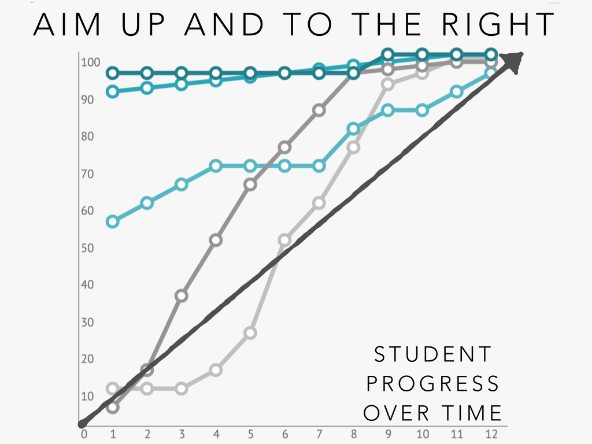
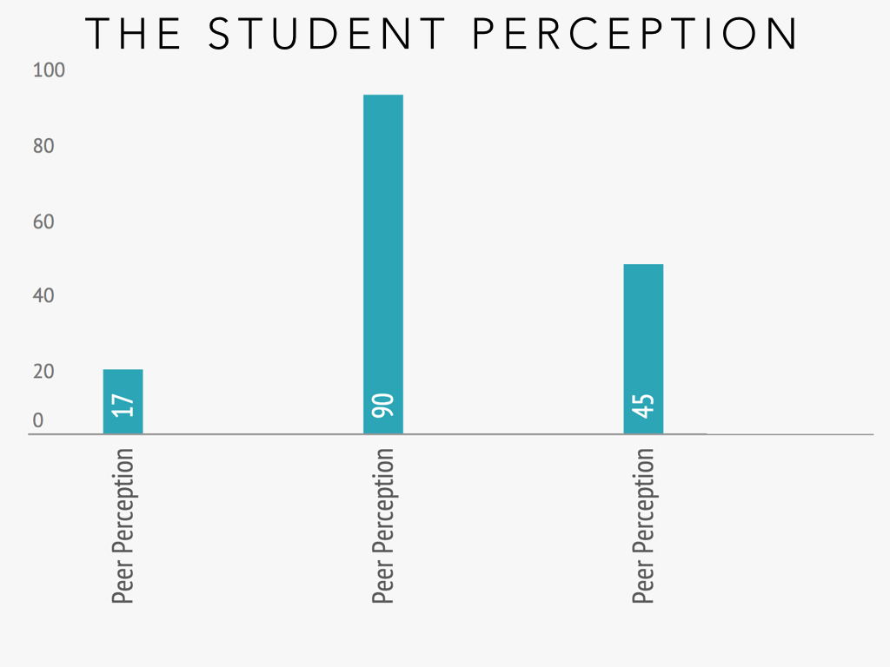
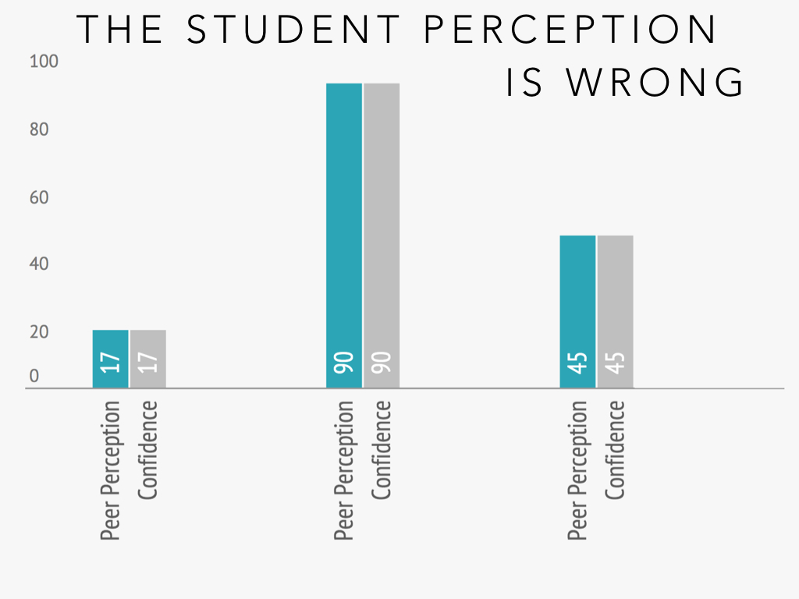
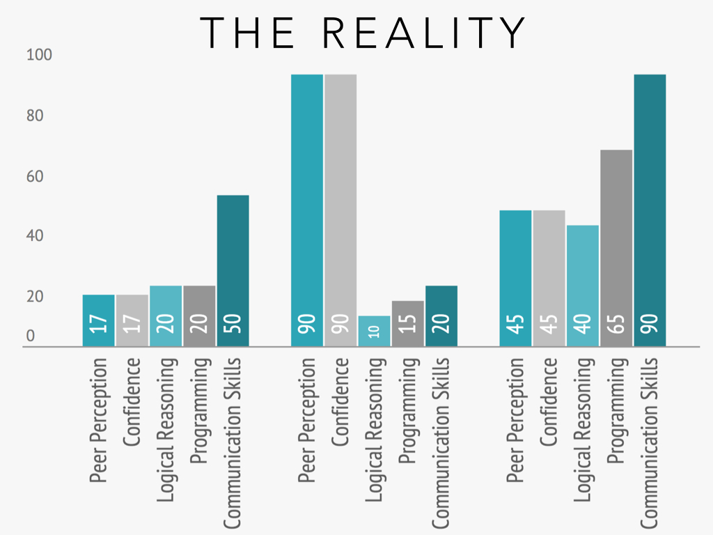
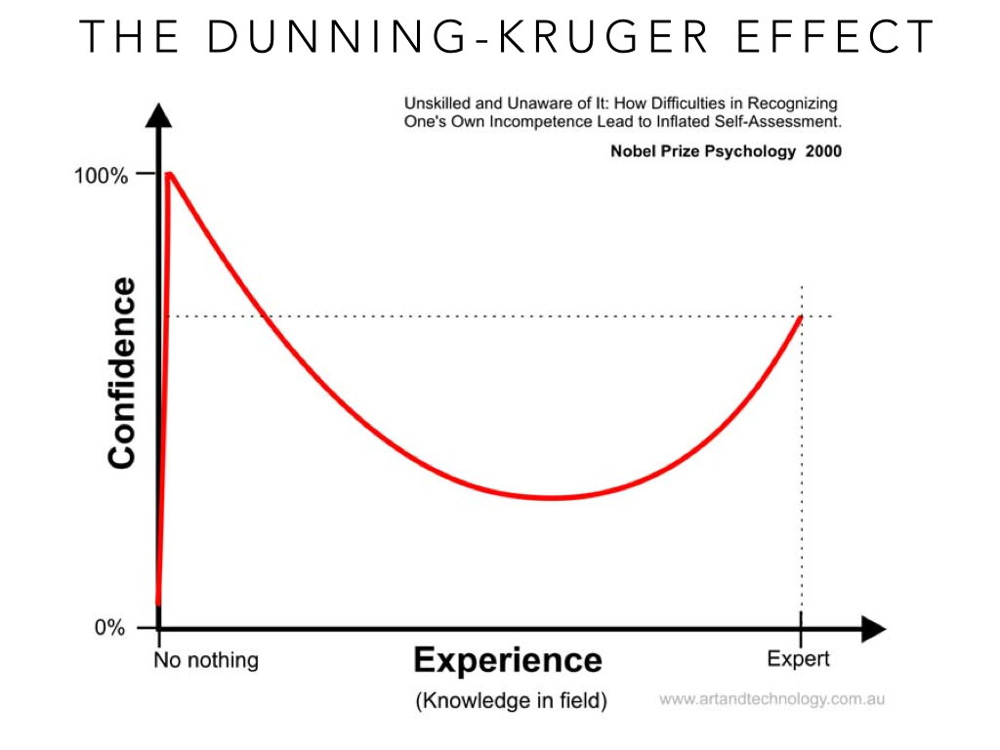
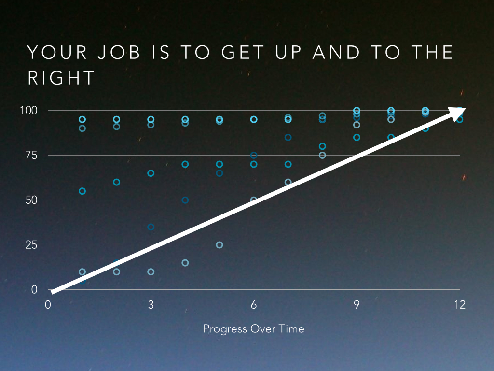
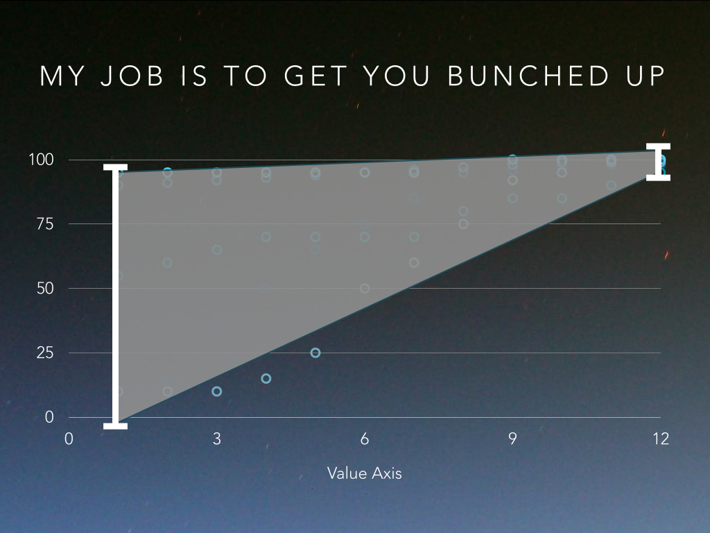
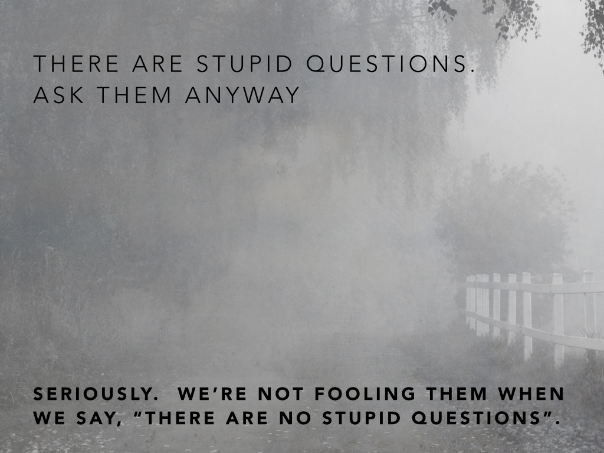

# Advice to Students

## Learning to Program is a Process

You can't rush it.

In my view, programming is, primarily, an analytical process wherein we take human thought and shape it into something that can be expressed to and via a computer in a very literal way.

## Framing the Problem is the first step

My favorite way to illustrate this is with the Train Problem.

Train A leaves the station at 2:15, going 20 miles per hour.  
Train B Leaves the station at 3:00, going 45 miles per hour.  
When do they collide?

### The Hard Way:

I’m not going to lie.  The first time I was shown this problem, I thought “Oh, snap.  We’re going to have to use calculus”.  On the surface, this is a hard problem to solve, with multiple moving objects going at different speeds.

However, my teacher’s purpose in showing us this problem wasn’t to teach us math.  It was to teach us about how to frame (and reframe) problems.

### The Easy Way: Reframe the Problem

In this case, you can take all the pain out of the calculations by treating Train A as a fixed point, and using relative velocity.  It doesn’t matter where the trains are in space.  It only matters that Train B is 15 miles away from Train A and headed towards it at a relative velocity of 25 miles per hour.

This is the single most valuable thing I learned in physics and I think about it constantly in my work.  The moment you reframe the problem, it solves itself.

## We are all Students

I get better at programming every time I teach.  There is no "done" when learning to be a programmer.

## Aim Up and to The Right

As long as our skills are going up and to the right, we’re doing it right.  It doesn’t matter if you start out at 10% or 90%, as long as you’re learning.

## Don't Compare Yourself

While we’re at it, comparing yourself to your peers is a losing game.

### The Student Perception

This is a student’s perception of three of their peers.

It looks like the guy in the middle is a rock star, right?

### The Student Perception is Wrong

Nope. Novices can only really perceive each other’s confidence.  Not their actual skills.

### The Reality

The reality is that every student has a spectrum of skills that they’re working on.  Each person has strengths and weakness that can’t be summed up with a ranking.

### Dunning-Kruger

And, to top it off, people are just awful at self-evaluation.

## You Have to Do It, Not Read It

Trying to learn programming without actually programming is about as effective as trying learning to ride a bike without a bicycle.

## You Are Not Dumb

## Your Job vs. My Job

### Your Job is to Aim Up and To The Right

### My Job is to Get You Bunched Up

## "Stupid" Questions Need Asking

There Are Stupid Questions.  Ask Them Anyway

You know when you're about to ask a stupid question.  What you don't know is that half the class is desperately wondering the same thing.

Some people say "The only stupid question is the one you don't ask".  That is also true.

## Socratic Questioning is the Answer

## Image Credits

