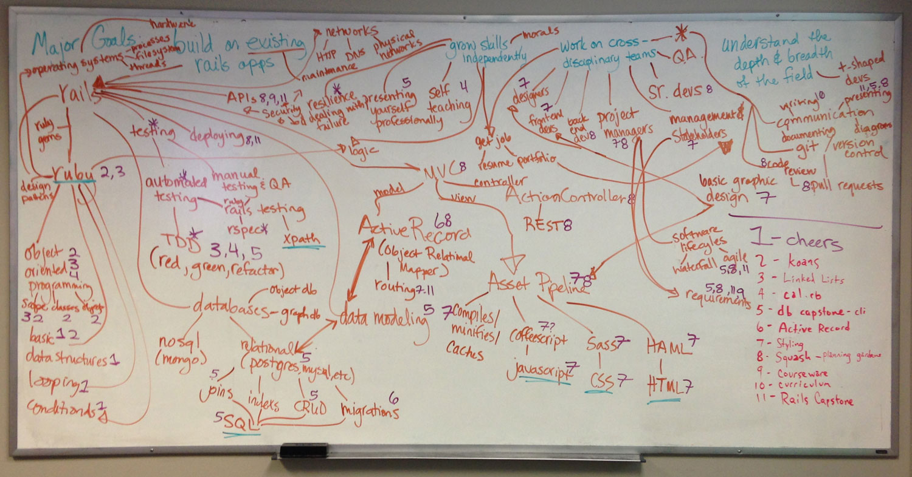

Software Development Fundamentals with Ruby and Rails
====

## Topics

## Teaching Style

This course is taught in a fairly free-form manner.  We have a list of topics and exercises that we will be working through, however I typically cover topics based on when students ask questions that lead us into that material.

## Schedule

The class will consist of 4 units over 12 weeks.

Typically the schedule is:

* Instructional time from 9AM to 12PM, daily.
* Lab time from 1PM to 4PM, daily.

Each day generally starts with standup and then continues with lecture topics with discussion time and breaks.

After a lunch break, students work on individual assignments and research.

### 1. Using Test-Driven Development To Learn Ruby / Using Ruby to Learn Test-Driven Development

**Goal**: Demonstrate competence in standard-library Ruby.

**Capstone**: Implement a variant of `cal`.

**Major Topics**:

  * Ruby Koans
  * Linked Lists
  * Basic Intro to Computer Science
  * Test-Driven Development

**Schedule**:

  * Week 1: Warm-up and dive into the Ruby Koans
  * Week 2: Exploring basic Computer Science with Linked Lists
  * Week 3: Mathematics refresher; Intro to Software Requirements & Specification; Starting Cal
  * Capstone: Cal

### 2. Exploring SQL and the Ruby Ecosystem

**Goal**: Demonstrate mastery of basic git, project documentation (README, comments), writing unit tests, SQL and basic Ruby.

**Capstone**: TDD Command-line Ruby Application.

  * Week 4: Discuss and refactor Cal; Set theory;
  * Week 5: Introduction to SQL; Northwinds database; ERDs; Small SQL statement project; Choosing capstone projects
  * Week 6: User stories; Integration testing; Begin SQL capstone projects
  * Week 7: Work on capstone projects; Error checking; Intro to storing and importing data with Ruby (e.g. File, CSV, etc.); Live-coding in-class SQL project
  * Week 8: Project presentations; ActiveRecord; Refactoring projects into ActiveRecord

### 3. Developing a simple Rails application

**Goal**: Students develop an awareness of how the components of Rails interoperate and the basics of developing a Rails Application.

**Capstone**: Pair-programming a feature in the in-class Rails project.

  * Week 9: MVC; REST; Overview of Rails; In-class Rails project; Assign group projects; Begin career prep
  * Week 10: Presenting group work; Choosing capstone 4 projects; Software requirements

### 4. Advanced Topics and Career Prep.

**Goal**: Students form an understanding of the depth and breadth of the field while meeting many of the practicing developers in Nashville.

**Capstone**: Develop a resume-worthy Rails application using TDD.

Lectures in this final portion of the class will be delivered primarily by mentors and community members on their individual areas of expertise.  Other lectures will be pulled from material in the topic list that won't have been covered in previous units.

  * Week 11: TBD; Work on capstone project; Career prep; Advanced Topics
  * Week 12: TBD; Work on capstone project; Career prep; Advanced Topics

Guest lecture topics are determined in large part by student interest and mentor availability.
