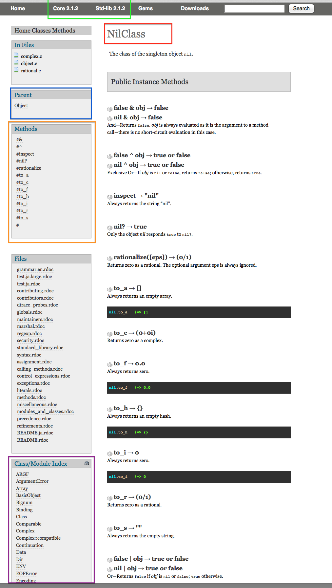
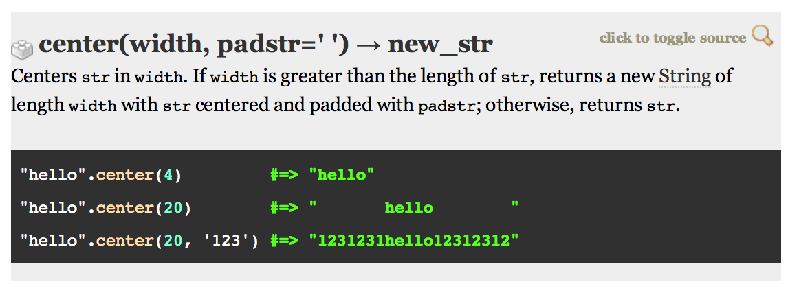
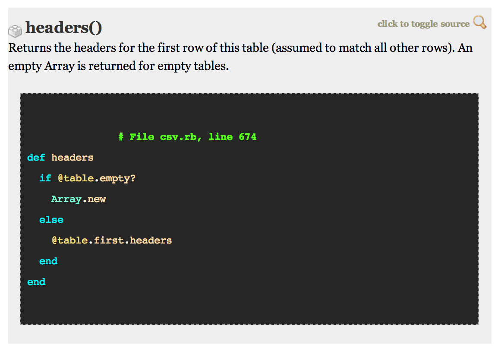

# RDoc Documentation

RDoc is the standard documentation format for Ruby.  You can view the documentation for almost in anything via. RDoc.

## Finding RDoc

The sources for RDoc documentation vary depending on what you're looking for documentation on.

In order to explain where to find the documentation, we first need to clarify the types of Ruby code that you'll encounter:

  * _core ruby_ is part of Ruby that is the core of the programming language.  Examples of this are strings, arrays, and any other classes that you can use without `require`ing them.
  * _standard library ruby_ are the parts of Ruby that come with your default Ruby installation, but aren't loaded by default when you run Ruby.  These are the libraries which you have to `require` in order to use, like Net::HTTP and CSV.
  * _gems_ are libraries of Ruby code that are published to the internet and installed via RubyGems.

For each of those types of code, there is a slightly different standard place to go to for documentation.

  * Core library documentation is available at [ruby-doc.org](http://ruby-doc.org/core-2.1.2/) via the "Core 2.1.2" link in the site navigation.
  * Standard library documentation is available at [ruby-doc.org](http://ruby-doc.org/stdlib-2.1.2/) via the "Std-lib 2.1.2" link in the site navigation.
  * Gem documentation is available via [rdoc.info](http://rdoc.info/), based on the name of the gem.  A local copy of the documentation for gems you already have installed can be read by running `gem server` and then visiting [localhost:8080](http://localhost:8080) in your web browser.

## Reading RDoc

When you open the documentation for a class in RDoc, you'll see something very similar to the color-coded image below.

I've highlighted various sections of the documentation to indicate points of interest:

  * Green: Main navigation- indicates which version of Ruby you're reading the docs for.  You should make sure you're always reading the docs for the actual version of Ruby you're using.
  * Red: The name of the class whose documentation you're currently reading.
  * Blue: A link to the parent class of the class whose documentation you're viewing.
  * Orange: links to all of the methods available in this class.
  * Purple: links to other classes and modules related to this class.

As you scroll down the documentation, you'll see documentation for each of the methods in that class.  You can also jump directly to a particular method's navigation by clicking on the name of the method in the left-hand navigation.

An example of method document is shown below.  This is the documentation for the `String` class's `center` method.

It starts by telling you about the method signature: the name of the method is (`center`) and the arguments that it can take (`width` and, optionally, a `padstr`).  The `padstr = ''` is telling us that the `padstr` argument is optional and that it will be set to the default value of `''` if we don't pass in that second argument.

  You can learn a lot about the method from it's signature. I recommend reading more about this in the SitePoint article referenced below.

The next portion of the documentation consists of a short description of what this method does, followed by several examples of the method in action.  These examples can be particularly helpful as you're learning about core Ruby classes, such as `String`, `Enumerable`, and `Array`.

When I took the screenshot above, I was hovering my mouse above the method documentation, so that we can see the 'click to toggle source' link.

If you click the 'click to toggle source' link, the documentation will expand to show the actual source of the method.  The source of a method is typically Ruby code, however in the core library there is a certain amount of code written in C (for speed), rather than pure Ruby.

The example below is from the documentation for the standard-library class `CSV`'s method `headers`.  You can see the actual code for the `headers` method in the black box.

## Writing RDoc

It's unlikely that you will end up writing RDoc during this course.  However, if you're interested in learning more about how to write RDoc, please do peruse the links in the reference section, below.

## Sources and Further Reading

* [RDoc Markup Reference](http://www.mikeperham.com/wp-content/uploads/2010/12/rdoc.html)
* [Ruby Method Signatures on the SitePoint blog](http://www.sitepoint.com/method-signature-you-can-sink-your-teeth-into/)
