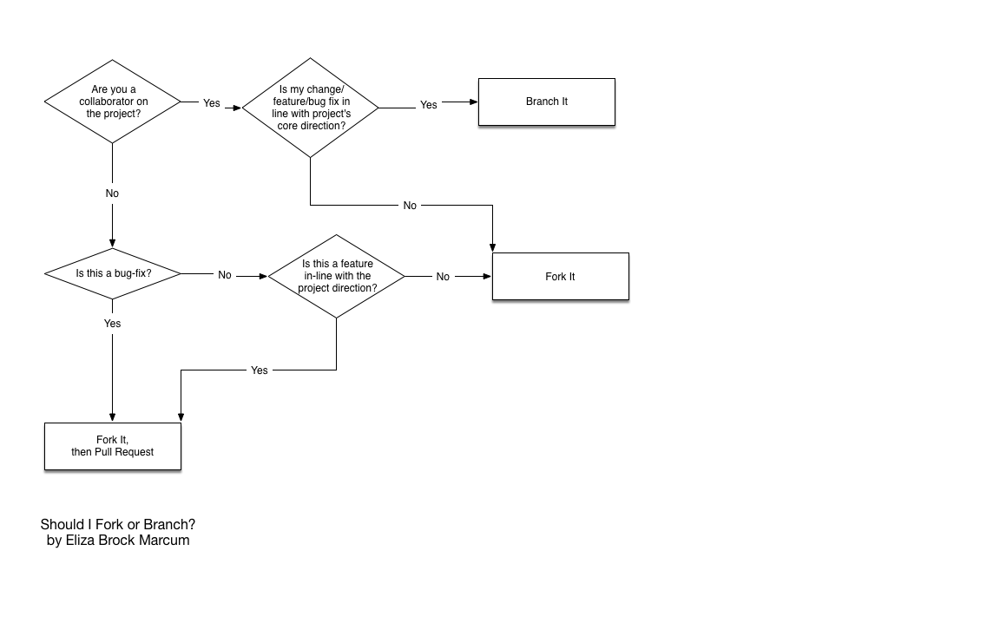
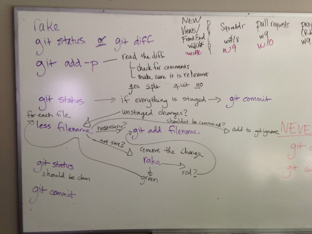

# Version Control with Git

You should have covered git in some detail in the previous class.  This is here to serve as a reference and refresher.

<blockquote class="twitter-tweet" lang="en">
OH “you are not exactly git blameless here.”
&mdash; Justin Searls (@searls) <a href="https://twitter.com/searls/statuses/243768104813993984">September 6, 2012</a></blockquote>

## Why version control?

  * Backup
  * Rollback
  * History
  * Deployment
  * No Emailing Files
  * No more index.final.v6.html, etc.

## GIT

  * Distributed
  * Fast
  * Complicated

## Basic GIT commands

You should know how to:

  * Create a local repository
  * Add files to the repository
  * Commit those files (-m)
  * Check the repository status
  * Commit more files
  * Looking at all of your commits (and --pretty=oneline)
  * Interactive add changes

See more at: http://gitimmersion.com

## .gitignore

Gitignore tells git about files that you never, ever want to commit.  Examples of these files are things like .DS_Store, editor-specific files and files that contain sensitive information or logs.

### Global .gitignore

Global .gitignore files are great for ignoring operating system specific files (such as .DS_Store) that you will never want to accidentally commit.

* https://help.github.com/articles/ignoring-files
* http://devoh.com/blog/2013/01/global-gitignore

## Hidden Files

If you're having trouble seeing certain files in OS X Finder, you'll want to enable viewing hidden files:

* http://mac.tutsplus.com/tutorials/os-x/quick-tip-revealing-hidden-files-in-os-x/

## Should You Fork or Branch?

## Resources for when things go wrong:

Start with [gitpretty.pdf](git-pretty.pdf), and then take a look at the links below.

* [On undoing, fixing, or removing commits in git](https://sethrobertson.github.io/GitFixUm/fixup.html)
* [Seriously, The Reflog Isn’t That Scary
Harnessing the power of git-reflog for good](https://medium.com/@./seriously-the-reflog-isnt-that-scary-a4189dd88c40)

## Sources & Further Reading:

* [A Visual Git Reference](http://marklodato.github.io/visual-git-guide/index-en.html)
* [GitRef.org](http://gitref.org/)
* [GitHub Guides](https://guides.github.com/)

### TODO:

We use a fairly specific workflow for git in this class.  We typically discuss it as we work through the projects, but you can see a summary of it in the image below:

