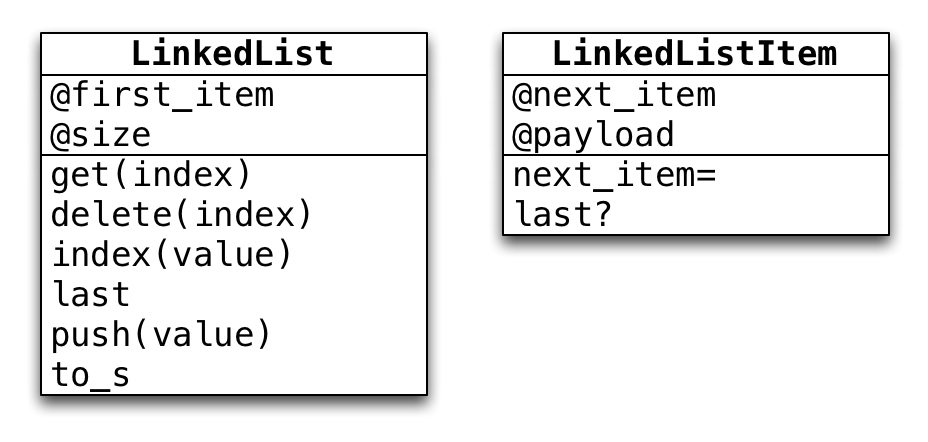
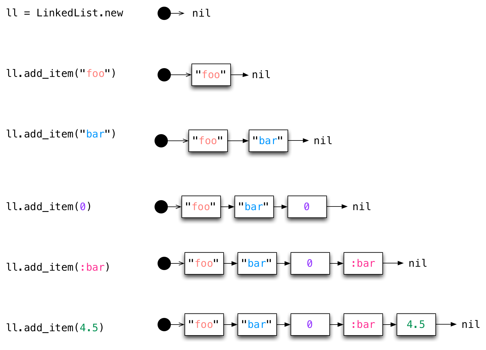
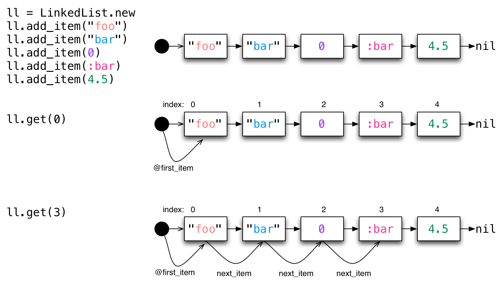
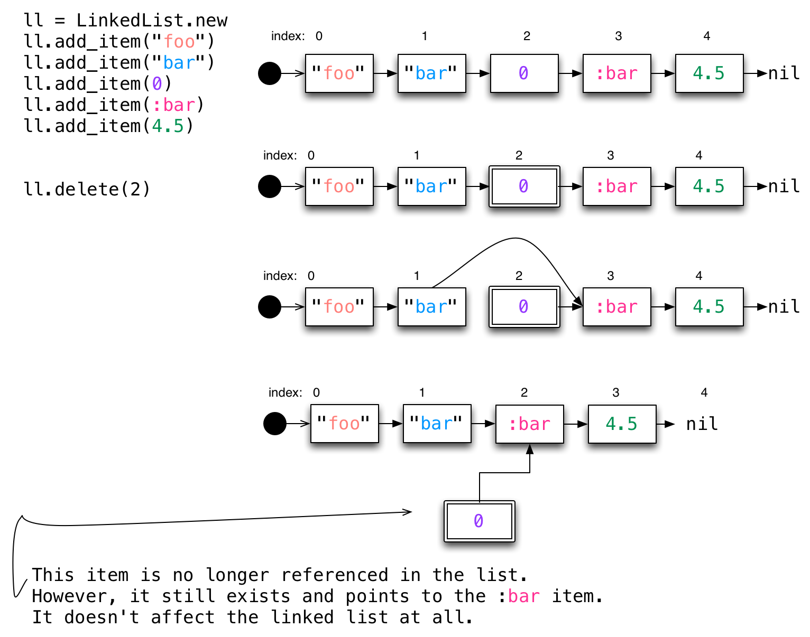
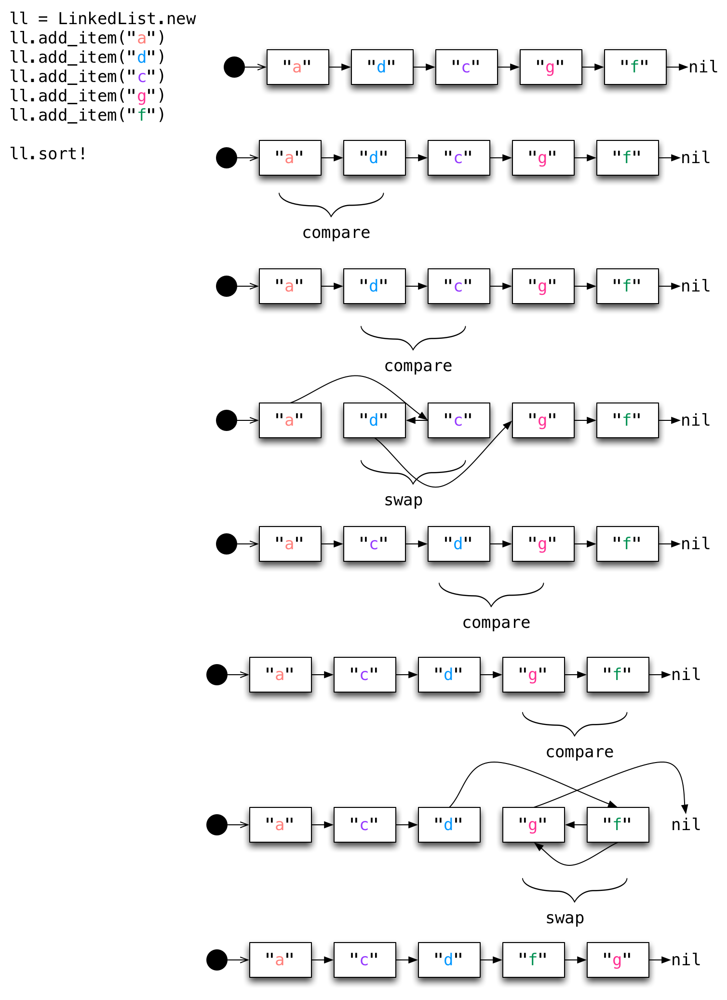

# Linked Lists

## UML

## Add

## Traversal

## Delete

## Sort

# References & Further Reading

* [Wikipedia: Linked list](http://en.wikipedia.org/wiki/Linked_list)
* [CMU: Link Lists](http://www.cs.cmu.edu/~adamchik/15-121/lectures/Linked%20Lists/linked%20lists.html)
* [Standford: Linked List Basics](http://cslibrary.stanford.edu/103/) (This is based on C/C++ which uses pointers.  This is the more traditional implementation, but isn't an option in Ruby).
