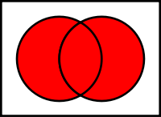
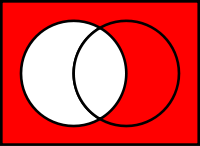

# Gates

The most important gates to understand are `and`, `or`, `not`, and `xor`.  There are a number of other gates that you can learn about by reading the articles in the resources section.

The inputs to gates come from the left side and the output comes out the right.  The logic and truth tables are explained in more depth in the logic and truth table articles- The goal of this article is to just demonstrate the shapes that represent the actual binary gates.

## AND

A truth table illustrating AND:

    | A | B | A && B |
    | 0 | 0 | 0      |
    | 0 | 1 | 0      |
    | 1 | 0 | 0      |
    | 1 | 1 | 1      |

## OR

A truth table illustrating this:

    | A | B | A || B |
    | 0 | 0 | 0      |
    | 0 | 1 | 1      |
    | 1 | 0 | 1      |
    | 1 | 1 | 1      |

## NOT

!A is true if A is false

A truth table illustrating this:

    | A | !A |
    | 0 | 1  |
    | 1 | 0  |

## XOR

A truth table illustrating this:

    | A | B | A XOR B |
    | 0 | 0 | 0       |
    | 0 | 1 | 1       |
    | 1 | 0 | 1       |
    | 1 | 1 | 0       |

## Resources:

* [Wikipedia: Logic Gates](http://en.wikipedia.org/wiki/Logic_gate)
* [Logic.ly](http://logic.ly/)
* [Basic Gates and Functions by Richard Bigwood](http://www.ee.surrey.ac.uk/Projects/CAL/digital-logic/gatesfunc/index.html)
