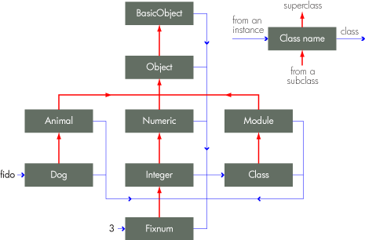
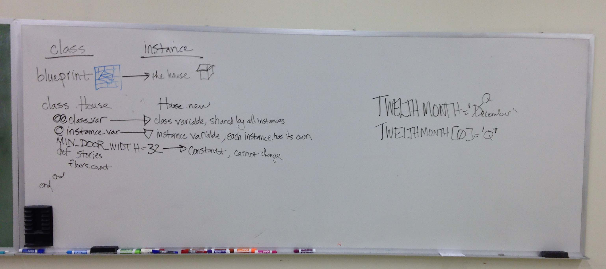
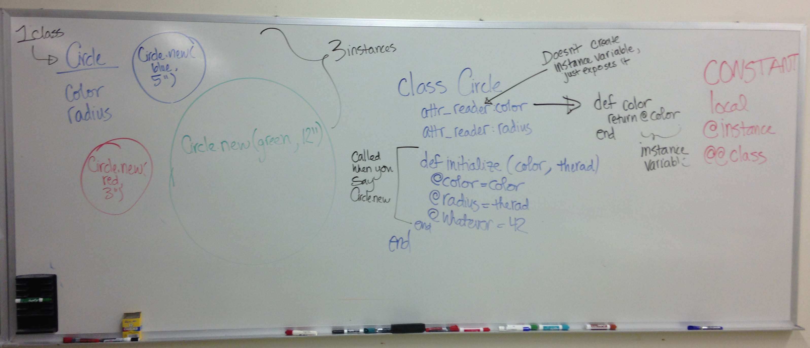
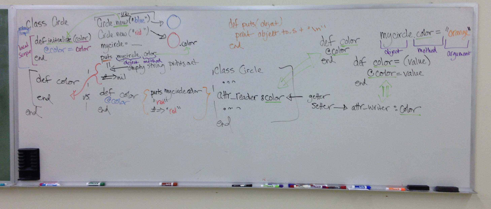
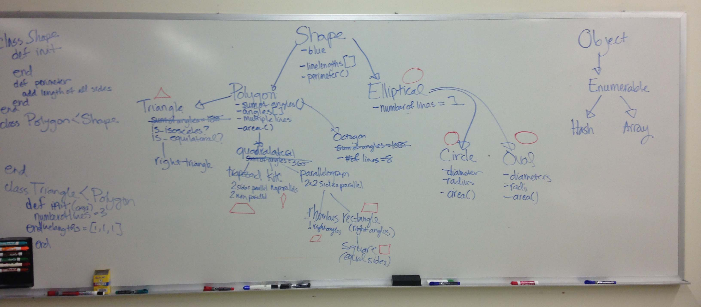
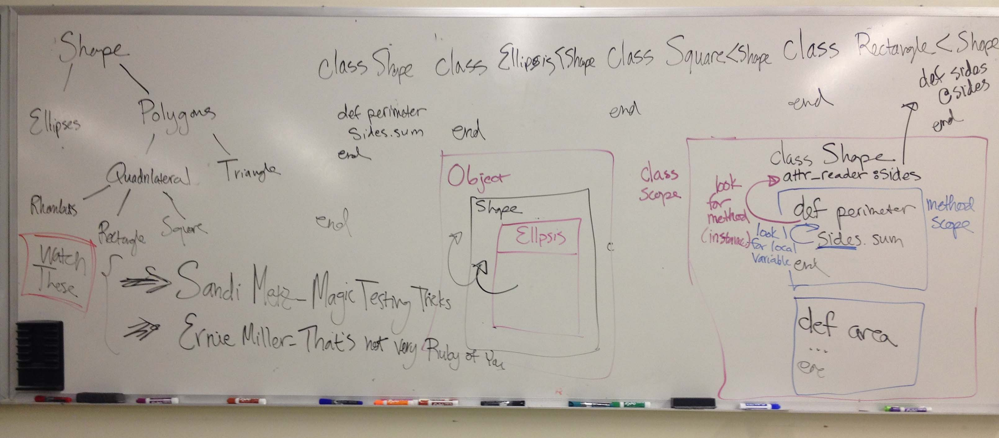

# Classes and Inheritance

## Classes

### A Little About Classes

A **class** is the blueprint from which individual objects are created.

In Ruby, classes are first-class objects--each is an instance of class <code>Class</code>.

### How to Define A Class

A class always starts with the keyword *class*, followed by the name of the class. The name of the class should always start with a capital letter. By convention, names that contain more than one word are run together with each word capitalized and no separating characters (aka CamelCase). You terminate a class by using the keyword *end*.

Here is an example of how to define a class:

      class Name
        # some class describing the class behavior
      end

An object of type Class is initialized when a new class is created and assigned to a global constant(<code>Name</code> in this case).

### More About Classes

The class definition may contain method, class variable, and instance variable declarations as well as calls to methods that execute in the class context at read time, such as attr_accessor.

Classes, modules, and objects are interrelated. Check out the diagram below. The vertical arrows represent inheritance and the parentheses represent meta-classes. All meta-classes are instances of the class 'Class'.

                                     +---------+             +-...
                               |         |             |
               BasicObject-----|-->(BasicObject)-------|-...
                   ^           |         ^             |
                   |           |         |             |
                Object---------|----->(Object)---------|-...
                   ^           |         ^             |
                   |           |         |             |
                   +-------+   |         +--------+    |
                   |       |   |         |        |    |
                   |    Module-|---------|--->(Module)-|-...
                   |       ^   |         |        ^    |
                   |       |   |         |        |    |
                   |     Class-|---------|---->(Class)-|-...
                   |       ^   |         |        ^    |
                   |       +---+         |        +----+
                   |                     |
      obj--->OtherClass---------->(OtherClass)-----------...

A class is used to construct an object. You can ask any object of which class it is a member of by using its Object.class method. For example:

      class Dog
        d = Dog.new('Husky', 'Sasha')
        puts d.class
      end  

The output would be:

      Dog

Instances of classes can be created with <code>.new</code>. For example:

      fido = Dog.new  

### Instance Variables

Instance variables are created for each class instance and are accessible only within that instance. They are accessed using the @ operator. Outside of the class definition, the value of an instance variable can only be read or modified via that instance's public methods. For example:

      class MyClass
        @one = 1
        def do_something
          @one = 2
        end
        def output
          puts @one
        end  
      end
      instance = MyClass.new
      instance.output
      instance.do_something
      instance.output

This outputs:

      nil
      2

The <code>nil</code> in the first output line happens because <code>@one</code> defined below *class MyClass* is an instance variable belonging to the class object, whereas <code>@one</code> defined inside the *do_something* method is an instance variable belonging to instances of *MyClass*. They are two distinct variables and the first is accessible only in a class method.

# Inheritance #

### Inheritance is the relationship between two classes. ###

Inheritance is a key concept in object oriented programming. It links classes together into a hierarchy, emulating the physical world in which specific species are categorized by their inherent characteristics as part of a larger, broader classification. For example, we know that all cats are mammals and that all mammals are animals. In Ruby, a class can only directly inherit from one other class. This is different from some other OOP languages where classes can inherit from multiple classes at once.

Classes have the ability to inherit features and behavior from another class. In the hierarchical chain, the class inheriting from another is called the *subclass* or child of the parent or *superclass* (also referred to as the base). This relationship means that the subclass, or child, will receive the methods defined in the parent class.

Inheritance is indicated in Ruby with the < symbol. An example of simple inheritance is below:

    class Parent

      def implicit()
        puts "PARENT implicit()"
      end
    end

    class Child < Parent

    end

    dad = Parent.new()
    son = Child.new()

    dad.implicit()
    => PARENT implicit()
    son.implicit()
    => PARENT implicit()

As you can see, the method 'implicit' can be performed on both an instance of the Parent class as well as the Child class without redefining any method inside of Child.

### Top of the food chain ###

All classes have a link to a superclass. If you don’t explicitly inherit from another class in a class definition (ie  < symbol), that class will inherit directly from the *Object* class. This means that all objects have access to *Object*'s methods unless explicitly overridden (see [ruby docs](http://ruby-doc.org/core-2.1.2/Object.html) for listing of methods).

Even though all classes eventually lead back to *Object*, the highest class in ruby's inheritance hierarchy is *BasicObject*. BasicObject is an explicit blank class that is used for creating new object hierarchies independent of Ruby's object hierarchy. Below is a basic diagram to help describe what we have been discussing (note - Animal and Dog classes are examples of custom classes).

In this example where the classes *Animal* and *Dog* have been created, we could write out the inheritance chain like this: Dog < Animal < Object < BasicObject. Fido is an instance of the class Dog, just as the number 3 is an instance of the built-in Ruby class *Fixnum*.

You will notice all the blue arrows eventually finding their way to *Class*. This is because every class is an instance of *Class*. When a new class is created, an object of type *Class* is initialized and assigned to a global constant (Dog in this case). When *Dog.new* is called to create a new object (ie Fido), the *new* method in Class is run by default. The discussion above regarding classes explains this further.

### Overriding Inheritance ###

Sometimes you want a method that is inherited from a superclass to have different or slightly altered functionality in your subclass. To do this, all we have to do is redefine the method in the subclass.

    class Parent

      def override()
        puts "PARENT override()"
      end
    end

    class Child < Parent

      def override()
        puts "CHILD override()"
      end
    end

    dad = Parent.new()
    son = Child.new()

    dad.override()
    => PARENT override()
    son.override()
    => CHILD override()

In this example, dad.override() will print out "PARENT override()" whereas son.override() will print out "CHILD override()". This is because we have redefined the *override* method inside of the *Child* class.

### Super ###
Another way to override an inherited method inside of a subclass is by using the keyword *super*. This keyword calls the parent version of the method you are redefining. This allows you to add code both before and after the parent code block.

    class Parent

      def altered()
        puts "PARENT altered()"
      end
    end

    class Child < Parent

      def altered()
        puts "CHILD, BEFORE PARENT altered()"
        super()
        puts "CHILD, AFTER PARENT altered()"
      end
    end

    dad = Parent.new()
    son = Child.new()

    son.altered()

The result of calling *son.altered()* will be:

    CHILD, BEFORE PARENT altered()
    PARENT altered()
    CHILD, AFTER PARENT altered()

## Sources and Further Reading
* [Class RDoc](http://www.ruby-doc.org/core-2.1.2/Class.html)
* [Writing our own Class in Ruby](http://rubylearning.com/satishtalim/writing_our_own_class_in_ruby.html)
* [Ruby Classes and Objects](http://www.tutorialspoint.com/ruby/ruby_classes.htm)
* [Composition vs Inheritance](http://ruby.learncodethehardway.org/book/ex44.html)
* [Ruby Overriding Methods](http://rubylearning.com/satishtalim/ruby_overriding_methods.html)
* [Initialize and Super](http://odetocode.com/Blogs/scott/archive/2010/07/13/ruby-initialize-and-super.aspx)
* [Ruby User Guide to Inheritance](http://www.rubyist.net/~slagell/ruby/inheritance.html)
* [Ruby Inheritance - rubylearning.com](http://rubylearning.com/satishtalim/ruby_inheritance.html)
* [Understanding the Ruby Object Model](http://skilldrick.co.uk/2011/08/understanding-the-ruby-object-model/)

### TODO: Incorporate the shapes discussion into this article

