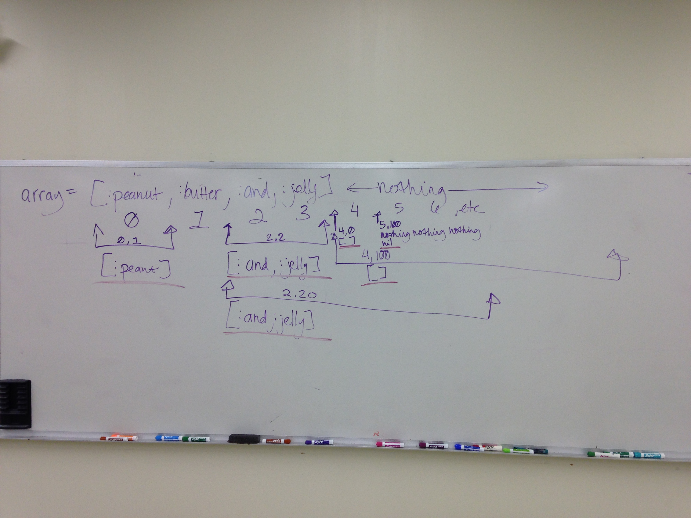
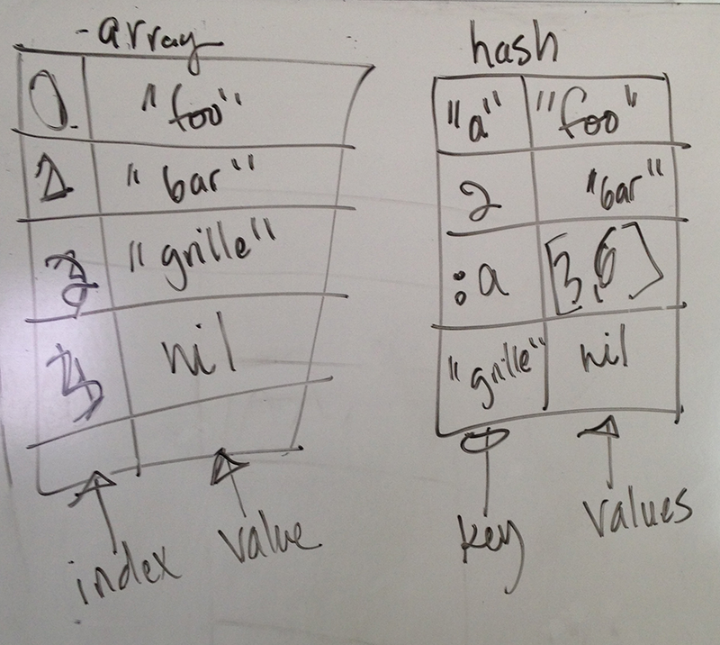
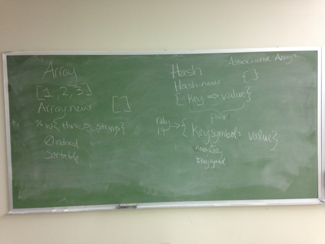
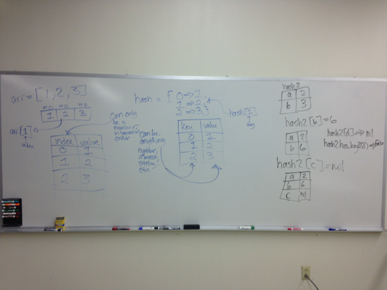

# Arrays
----
## What is an Array?
* An array is a collection of objects separated by commas and indexed by integers starting at 0.
* Arrays can include any mixture of objects types.

        example_array = ["cat", :dog, true]

## Creating An Array
* **Array.new** will create an empty array.
* An array can also be created by simply adding elements between the brackets.
* For the rest of the topics we will be using the **sandwich** array as an example.

        sandwich = [“peanut”, “butter”, “and”, “jelly”]

## Accessing Array Elements
* To access array elements start with the name of the array followed the index of the element in brackets:

        sandwich[0] = “peanut"

* Using .first and .last is also acceptable:

        sandwich.last = "jelly"

* Using a negative starts the index at the end:

        sandwich[-1] = "jelly"

## Slicing Arrays
* Slicing an array will select a particular section of an array.
* The first value is the index to start at and the second value is the amount of elements to select.

        first_ingredient = sandwich[0,2]
        puts first_ingredient #=> [“peanut”, “butter”]

## Ranges and Arrays
* A range is **not** an array.
* A range can be converted into an array by using **.to_a**

        new_array = (1..5).to_a
        puts new_array #=> [1, 2, 3, 4, 5]

## Using Ranges to Slice an Array
* Slicing an array using a range will take all of elements with an index number between the first and last number of the range.

        bad_sandwich = sandwich[1..3]
        puts bad_sandwich  #=> [“butter”, “and”, “jelly”]

## Pushin' and Poppin' with Array

### Pushing
* Pushing into an array will add an element to the end of an array.
* Pushing an element into an array can be done with **.push** or **<<**

        sandwich.push("belly")
        sandwich << "beans"
        puts sandwich #=> [“peanut”, “butter”, “and”, “jelly”, “belly”, “beans”]

### Popping
* Popping and array will remove the last value from an array:

        popped = sandwich.pop
        puts popped #=> “beans"
        puts sandwich #=>  [“peanut”, “butter”, “and”, “jelly”, “belly”]

## Shifting Arrays
* Using **.unshift** will add element to the beginning of an array

        colors = ["orange", "purple", "green"]
        colors.unshift("yellow")
        puts colors #=> ["yellow", "orange", "purple", "green"]

* Using **.shift** will return the first value in the array and remove the value from the array

        first_color = colors.shift
        puts first_color #=> "yellow"
        puts colors #=> ["orange", "purple", "green"]

## Array Assignments
* By defining arrays with comma separated variables, you can assign individual elements

        first_name, last_name = ["John", "Smith", "III"]
        puts first_name #=> "John"
        puts last_name #=> "Smith"

## Contrasting Arrays and Hashes

<!-- TODO: Expand this with explanations -->

## Further Reading
* [RubyDoc for Arrays](http://www.ruby-doc.org/core-2.1.2/Array.html)
