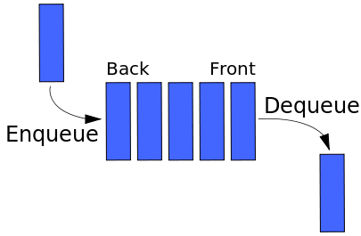

# Queues

Queues are a First-In First-Out (FIFO) data structure.

Queues are very efficient for adding and removing items.  However, you can only access items that are at the end of the list (e.g. no random access of elements).

    | Operation     | Efficiency |
    | Enqueue       | O(1)       |
    | Dequeue       | O(1)       |
    | Random Access | --         |

## Real World Examples:

* Waiting at the DMV
* Waiting in line, in general

## Uses in Software:

* Scheduling access to shared resources (e.g. printers)
* Scheduling work (e.g. job queues for worker processes)
