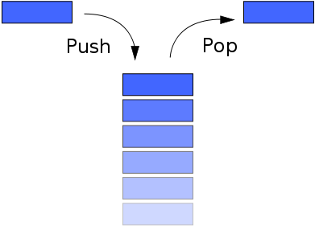

# Stacks

Stacks are a Last-In First-Out (LIFO) data structure.

Stacks are very efficient for adding and removing items.  However, you can only access items that are at the end of the list (e.g. no random access of elements).

    | Operation     | Efficiency |
    | Push          | O(1)       |
    | Pop           | O(1)       |
    | Random Access | --         |

## Real World Examples:

* Plates on a buffet plate dispenser
* Pancakes

## Uses in Software:

* Tracking progress through a maze
* Providing “unlimited undo” in an application
