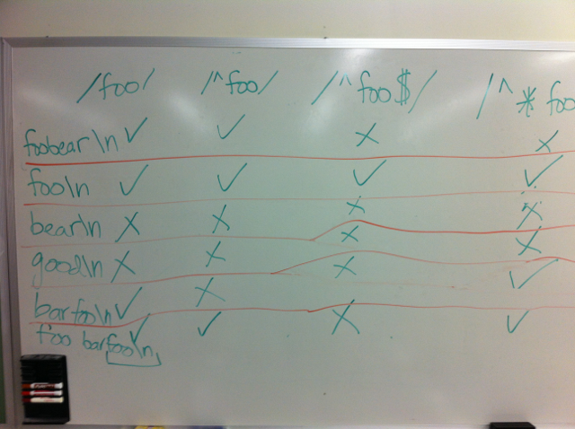
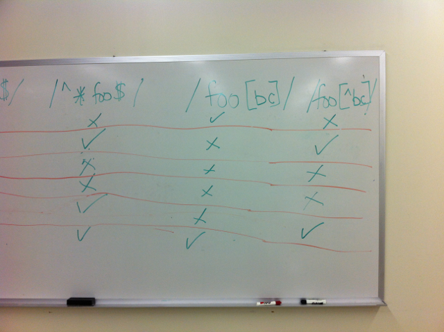

# Regular Expressions
A regular expression is a pattern that describes the contents of a string.
They can be used to test if a string contains a specified pattern,
and may also be used to extract or replace portions of a string that match the pattern.

Regular expressions are written with patterns and modifiers.
A pattern is the expression itself, and modifiers are additional options that can be used on the pattern.
A regular expression is written between two slashes with any modifiers following the second slash:
~~~
/regexpattern/x
~~~
They can also be written as follows:
~~~
%r{regexpattern}
~~~
or by using the Regexp.new constructor.

There are several metacharacters that must be backslash escaped to use as a literal:
* ,
* .
* ?
* +
* *

The format to escape these characters is:
~~~
/1\+1=2/
~~~

### Modifiers
* /i makes the match case insensitive.
* /m makes the dot match newlines.
* /x ignores whitespace between tokens
* /o makes #{...} substitutions only once. They are only performed the first time it is evaluated.

You can use multiple modifiers by stringing them together:
~~~
/regex/is
~~~

### Regular expression Patterns

* ^ Matches beginning of line.
* $ Matches end of line.
* . Matches any single character except newline. Using m option allows it to match newline as well.
* [...] Matches any single character in brackets.
* [^...] Matches any single character not in brackets
* re* Matches 0 or more occurrences of preceding expression.
* re+ Matches 1 or more occurrence of preceding expression.
* re?
Matches 0 or 1 occurrence of preceding expression.
* re{ n}
Matches exactly n number of occurrences of preceding expression.
* re{ n,}
Matches n or more occurrences of preceding expression.
* re{ n, m}
Matches at least n and at most m occurrences of preceding expression.
* a| b
Matches either a or b.
* (re)
Groups regular expressions and remembers matched text.
* (?imx)
Temporarily toggles on i, m, or x options within a regular expression. If in parentheses, only that area is affected.
* (?-imx)
Temporarily toggles off i, m, or x options within a regular expression. If in parentheses, only that area is affected.
* (?: re)
Groups regular expressions without remembering matched text.
* (?imx: re)
Temporarily toggles on i, m, or x options within parentheses.
* (?-imx: re)
Temporarily toggles off i, m, or x options within parentheses.
* (?#...)
Comment.
* (?= re)
Specifies position using a pattern. Doesn't have a range.
* (?! re)
Specifies position using pattern negation. Doesn't have a range.
* (?> re)
Matches independent pattern without backtracking.
* \w
Matches word characters.
* \W
Matches nonword characters.
* \s
Matches whitespace. Equivalent to [\t\n\r\f].
* \S
Matches nonwhitespace.
* \d
Matches digits. Equivalent to [0-9].
* \D
Matches nondigits.
* \A
Matches beginning of string.
* \Z
Matches end of string. If a newline exists, it matches just before newline.
* \z
Matches end of string.
* \G
Matches point where last match finished.
* \b
Matches word boundaries when outside brackets. Matches backspace (0x08) when inside brackets.
* \B
Matches nonword boundaries.
* \n, \t, etc.
Matches newlines, carriage returns, tabs, etc.
* \1...\9
Matches nth grouped subexpression.
* \10
Matches nth grouped subexpression if it matched already. Otherwise refers to the octal representation of a character code.

### Metacharacters
There are several metacharacters that behave like character classes:
*	/./ - Any character except a newline.
*	/./m - Any character (the m modifier enables multiline mode)
*	/\w/ - A word character ([a-zA-Z0-9_])
*	/\W/ - A non-word character ([^a-zA-Z0-9_]).
*	/\d/ - A digit character ([0-9])
*	/\D/ - A non-digit character ([^0-9])
* /\h/ - A hexdigit character ([0-9a-fA-F])
* /\H/ - A non-hexdigit character ([^0-9a-fA-F])
*	/\s/ - A whitespace character: /[ \t\r\n\f]/
*	/\S/ - A non-whitespace character: /[^ \t\r\n\f]/

Regex expressions are not limited to single usage. There are repetition metacharacters that specify how many times a sequence should occur.
* \*  Zero or more times
* \+ One or more times
* ? Zero or one times (optional)
* {n} Exactly n times
* {n,} n or more times

### Regexp Object

When you use /regex/ it creates a new object of the class Regexp.
This can be assigned to a variable and used multiple times or it can be used directly.

#### Matching
You can test regex matches by either using the .match() method or the =~ operator.

The =~ operator returns the position of a character in the string at the start of the match.
This means that in a boolean test, if found, it will evaluate to true. If not found, the result will be nil which evaluates to false.
The match() method returns a MatchData object (which also evaluates to true), or nil if no matches was found.

When dealing with strings, MatchData object evaluates to the text that was matched.

For example:
~~~
print(/\w+/.match("test"))
~~~
prints "test"

and:
~~~
print(/\w+/ =~ "test")
~~~
prints "0".

The first character in the string has index zero. Switching the order of the =~ operator's operands makes no difference.

### Special Variables
When either the =~ operator or the match() method are used, the special variable $~ is set.
Since this variable is thread local and method local, you can use it while your method exists or until the next time the =~ operator is used in that method.

$~ holds the same MatchData object returned by Regexp.match().

Several read-only special variables are derived from $~. If assigned a new instance of Match Data, all $~ variables are changed as well.

$& contains the text matched by the entire regular expression, while $1 holds the text matched by the first, $2 the second, and so on.

$+ holds the text matched by the highest-numbered capturing group that actually participated in the match.

$` and $' hold the text in the subject string to the left and to the right of the regex match.

### Search and Replace
 The sub() and gsub() methods of the String class are used to find and replace
 strings matching the given regex which is passed in as the first parameter.
 sub() finds and replaces the first match for the regex, and gsub() finds and replaces all matches.

### Splitting Strings and Collecting Matches
To collect all regex matches in a string into an array, pass the regexp object to the string's scan() method,
e.g.: myarray = mystring.scan(/regex/).
Sometimes, it is easier to create a regex to match the delimiters rather than the text you are interested in.
In that case, use the split() method instead, e.g.: myarray = mystring.split(/delimiter/).
The split() method discards all regex matches, returning the text between the matches.
The scan() method does the opposite.

If your regular expression contains capturing groups, scan() returns an array of arrays.
Each element in the overall array will contain an array consisting of the overall regex match,
plus the text matched by all capturing groups.

### Resources and Links
* http://code.tutsplus.com/tutorials/ruby-for-newbies-regular-expressions--net-19812
* https://www.bluebox.net/insight/blog-article/using-regular-expressions-in-ruby-part-1-of-3
* http://www.tutorialspoint.com/ruby/ruby_regular_expressions.htm
* http://www.regexr.com/
* http://rubular.com/
* http://www.ruby-doc.org/core-2.1.2/Regexp.html
* http://www.regular-expressions.info/ruby.html
* [Lea Verou: Demystifying Regular Expressions](http://www.youtube.com/watch?v=EkluES9Rvak)

### TODO:

Incorporate this chart in plain-text:

