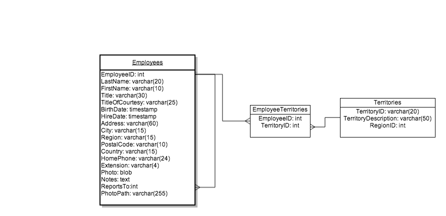

# Northwind ERD Diagram

Northwind is a classic training database, from Microsoft.

I (Eliza) have reformatted Northwind to use a Rails-style naming convention.

You can import the [Northwind](northwind_rails_style.sql) database using [SQLite Database Browser](https://github.com/sqlitebrowser/sqlitebrowser) or the [SQLite Manager Firefox Plugin](https://addons.mozilla.org/en-US/firefox/addon/sqlite-manager/)

## Create an ERD of the Northwind database.
> requires: introduction-to-databases, entity-relationship-diagrams, data-modeling

Use a diagramming tool (for example, [Lucid Chart](https://www.lucidchart.com/pages/er-diagram-tool)) to create a database diagram for the [Northwind](northwind_rails_style.sql) database.

An example beginning of this is:

User crow's foot notation, as per the reading in the Entity Relationship Diagrams article.

## Read about SQL
> requires: introduction-to-sql, introduction-to-set-theory

Note to instructor: the introduction-to-sql article needs to be expanded with examples for each of the headings.  Also, we typically cover sets and set theory (which could also stand to be expanded) just before/as we're beginning to talk about SQL

* Read the Introduction to Database article in the courseware
* Read: http://tutorials.jumpstartlab.com/topics/fundamental_sql.html
* Take a look at: http://sql.learncodethehardway.org/book/

## Take the SQL Queries Quiz
> requires: joins

After we discuss the ERDs you produced, and performed some basic querying in-class (Note to instructor: the ERD and these queries are in your notes.), take the SQL Queries Quiz, which will be accessible to you in the "Assignments" tab.

## Interact with the Northwinds database using the SQLite3 gem.
> requires: rubygems-and-bundler

After we have gone over the SQL Queries Quiz in-class, start working on this milestone.

Read the documentation for the sqlite library, here:

http://sqlite-ruby.rubyforge.org/sqlite3/faq.html

Then play around with it in `irb`.  Create a database, create a table, insert data, etc.

Submit this milestone once you're done playing around with the gem.
