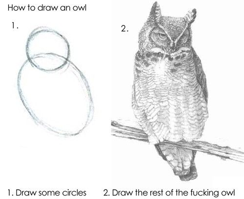

# The Pink Elephants Exercise

Communicating with people is hard.

Communicating with computers is harder.

See: http://xkcd.com/1133/

## In-Class Requirements Exercise

We're going to pair up for an in-class exercise.

<!-- The concept here is that we pair the students up.  One half of each pair is asked to leave the room for ten minutes.  The remaining half helps you find a simple random picture on the internet.  They are tasked with writing down/remembering as much as they can about the picture in 5 minutes. The rest of the class is asked to return, and told to draw the picture by asking their colleague for information and details.  The colleague can't tell them exactly what the picture is, or how to find it on the internet.  At the end, everyone shares their drawings. This illustrates the difficulties of software requirements in a fun way. -->

## Writing Software Requirements
> requires overview-of-software-development-lifecycles

Write down, in painstaking detail, exactly how to change a tire.
Assume an absolute asshole\* is going to try to fuck it up, while still following your instructions to the letter.

\* This is not a good pet name for your compiler/interpreter
