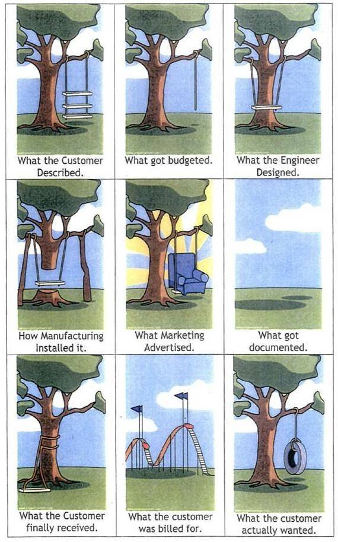

# Basic Project Planning

All of project planning is towards the goal of acknowledging and avoiding:

The major components of project planning in this course are:

* Wireframing
* User Stories
* Acceptance Criteria
