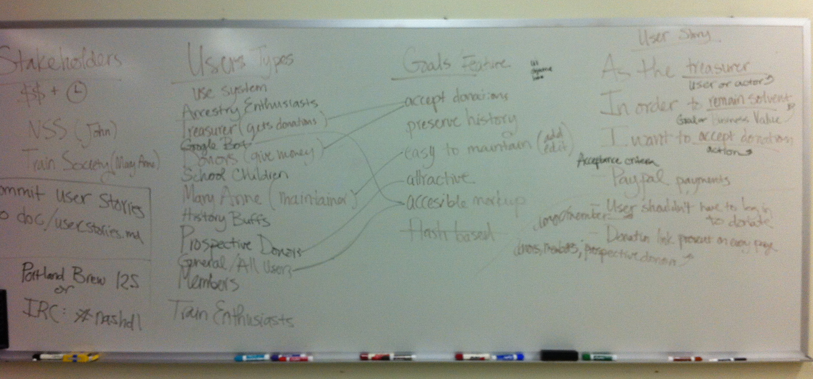

# User Stories

## User Types

User types are the broad categories of users and stakeholders in an application.  For example, in a healthcare application you may have nurses, doctors, patients, and patient advocates.

User types are often explicitly defined in requirements documents and referenced heavily in user stories.  In the example below, the "grocery shopper" is an example of a user type.

## User Personas

User personas are prototypical examples of a particular user type.  Some software teams will put together personas that include names, ages, biographical information and other details that make a persona that matches a particular user type.

## User Stories

The articles use a variety of specific approaches for the story format, but the general theme is all the same: who, what and why.

Every company/project has a different style for their user stories, but in general they should look like:

  > As a [user or actor]

  > In order to [accomplish goal X or achieve a given business value]

  > I want to [perform an action]

Example:

  > As a grocery shopper that has entered a few grocery trips into the application.

  > I want to get the average price I've paid for a particular item

  > In order to know if the sale in the weekly flyer is any good.

  > Usage: ./grocerytracker stats "Campbell's Chicken Soup"

  > Acceptance Criteria:
  > * Prints out average/min/max prices I've paid for that item
  > * If the item can't be found, it prints out a list of items with similar names

## How User Stories Relate to User Personas

## Sources & Further Reading

* [http://www.virtual-genius.com/resources/User%20Stories%20Quick%20Reference%20Guide.pdf](http://www.virtual-genius.com/resources/User%20Stories%20Quick%20Reference%20Guide.pdf)
* [http://www.boost.co.nz/blog/agile/user-stories/](http://www.boost.co.nz/blog/agile/user-stories/)
* [http://www.boost.co.nz/blog/agile/acceptance-criteria/](http://www.boost.co.nz/blog/agile/acceptance-criteria/)
* [http://www.nomad8.com/files/acceptance_criteria.php](http://www.nomad8.com/files/acceptance_criteria.php)
