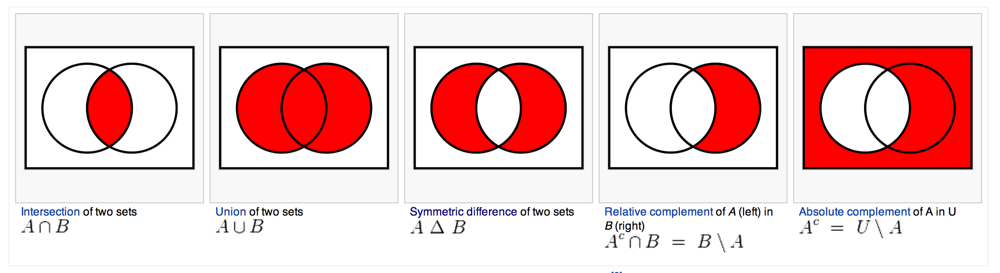

# Introduction to Set Theory

## Set Math

## Sources & Further Reading:

* [Jurnells's Sets and Set Theory Slide Deck](http://lectures.sophicware.com/set-theory/#1)
* [Wikipedia: Set Theory](http://en.wikipedia.org/wiki/Set_theory)
* [Wikibooks: Set Theory](http://en.wikibooks.org/wiki/Set_Theory)
* [Wikipedia: Venn Diagram](http://en.wikipedia.org/wiki/Venn_diagram)
* [Wikipedia: Set (Mathematics)](http://en.wikipedia.org/wiki/Set_(mathematics\))
