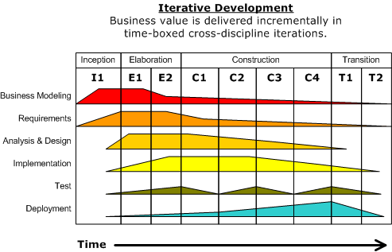

# Overview of Software Lifecycles

<!-- TODO: This was pulled directly from a slide deck, and I haven't filled in all of the words/explanations -->
## Waterfall

Waterfall has been around since 1970

## Iterative Development

But, the concepts behind agile software have been around since 1957, in the form of the Iterative Development Model:

## Agile

The Agile Manifesto was published in 2001, ushering in a new era of more people-focused software development.

### The Agile Manifesto
> We are uncovering better ways of developing
software by doing it and helping others do it.
Through this work we have come to value:
>
> Individuals and interactions over processes and tools
Working software over comprehensive documentation
Customer collaboration over contract negotiation
Responding to change over following a plan
>
> That is, while there is value in the items on
the right, we value the items on the left more.
> - http://agilemanifesto.org/

## Why so many software lifecycle options?

There's actually a reason:  Different approaches work better for different types of projects.  Contrast life-and-death software that runs medical devices to run-of-the-mill line of business web applications.

### Suitability of different development methods (from the Wikipedia article on Agile)

    | Agile                           | Plan-driven                | Formal Methods          |
    | Low Criticality                 | High Criticality           | Extreme Crit.           |
    | Sr. Devs                        | Jr. Devs                   | Sr. Devs                |
    | Requirements Churn              | Static Requirements        | Limited Req/Features    |
    | Small Dev Team                  | Large Dev Team             | Model-able Requirements |
    | Culture that responds to change | Culture that demands order | Extreme quality         |

## Why Software Project Management Matters

