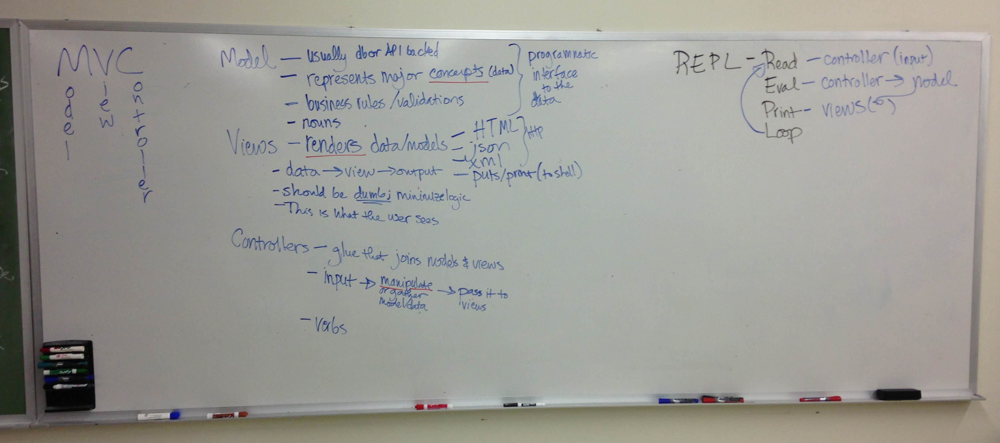
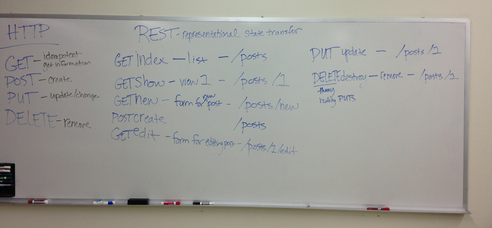

# Introduction to Rails

This is a placeholder article, outlined with the information we  discuss in class.

## How is rails structured?

### MVC

See the Model View Controller Pattern article. A whiteboard summary is below.

### Rails Architecture

http://betterexplained.com/articles/intermediate-rails-understanding-models-views-and-controllers/

### REST and Routing in Rails

### What do all the files do?
