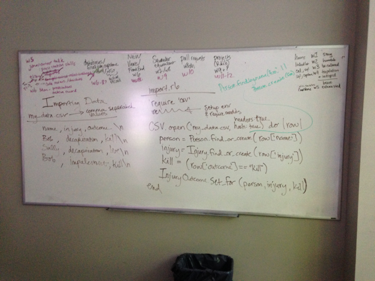

# Rails Patterns and Libraries

[Ruby Toolbox](https://www.ruby-toolbox.com/) is a great resource when researching possible gems to use in your applications.  General notes on common needs are below.

## Patterns

### Activity feeds

### Data Import

### Geocoding / Maps

### Permalinks / Slugs

### User stamping

### Web content scrapers

## Gems

### A/B Testing

[Vanity](http://vanity.labnotes.org/)

### Admin interface

[ActiveAdmin](http://activeadmin.info/)

### Asset Management & Image Processing

[CarrierWave](https://github.com/carrierwaveuploader/carrierwave) is a tool for uploading assets (e.g. attachments, avatars, documents, etc) to a Rails application.

[minimagick](https://github.com/minimagick/minimagick) is a wrapper to [ImageMagick](http://imagemagick.org/script/index.php) that CarrierWave can use to automatically resize/recolor/process image uploads.

[Fog](https://github.com/fog/fog) is a gem that allows CarrierWave to store assets on cloud services, such as Amazon S3.

### Authentication and Authorization

See the Authentication and Authorization article for an explanation of the difference betwen Authentication and Authorization.

#### Authentication Gems

[Sorcery](https://github.com/NoamB/sorcery) is the best option.  [Devise](https://github.com/plataformatec/devise) is the fastest to implement, and quite popular as a result, but requires a lot of overriding of defaults if you want to go beyond basic functionality.

For [OAuth](http://oauth.net/) authentication, you can use [OmniAuth](https://github.com/intridea/omniauth) with either of the authentication gems, above.

#### Authorization Gems

* [cancancan](https://github.com/CanCanCommunity/cancancan) is the current best option, although there are some newer alternatives that might be better at this point.

### Caching

See: http://hawkins.io/2012/07/advanced_caching_revised/

### Code Quality & Metrics

* [Code Climate](https://codeclimate.com/dashboard) is great for static analysis.  Free for open source projects.
* [Travis CI](https://travis-ci.org/) will run your tests to verify the code you push up to GitHub.  Free for open source projects.

### Configuration Management

[Figaro](https://github.com/laserlemon/figaro)

### Debugging

[bye-bug](https://github.com/deivid-rodriguez/byebug) is built into Rails.  And, as always, tests are your bffs when it comes to finding/fixing bugs in your code.

### Mail

[ActionMailer](http://guides.rubyonrails.org/action_mailer_basics.html) is built into Rails.  [letter_opener](https://github.com/ryanb/letter_opener) is a nice addition, to help you see what your mailers look like.

### Markdown Rendering

[RedCloth](http://redcloth.org/)

### Pagination

[Kaminari](https://github.com/amatsuda/kaminari)

### PDF Generation

[Prawn](https://github.com/prawnpdf/prawn)

### Queueing / Workers

[Resque](https://github.com/resque/resque)

[Delayed Job](https://devcenter.heroku.com/articles/delayed-job)

### Testing Gems

See the Testing in Rails article for information on the testing tools most commonly used in Rails.
