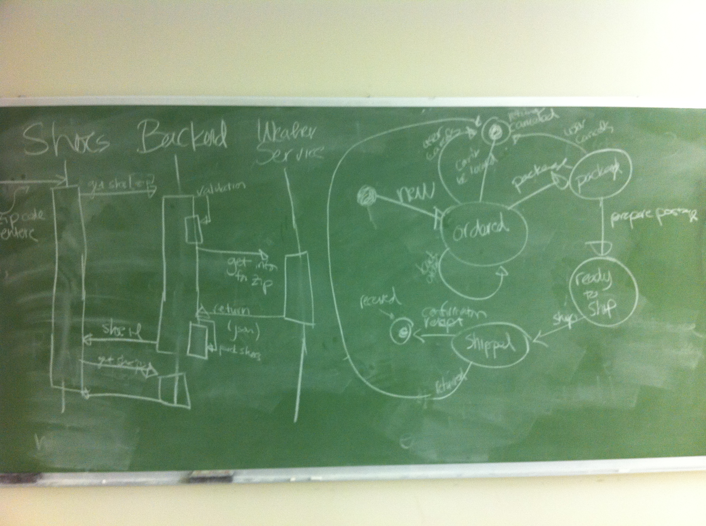

# Diagramming software

Diagrams are extremely helpful in communicating about software.

This is a quick outline of the go-to options in your diagramming toolbox.

## ERD: Entity Relationship Diagrams

Entity Relationship diagrams are used to illustrate how data is stored in a system, and how the various pieces of data are related.

See:
* the Entity Relationship Diagrams article.

## UML Class Diagrams

Class diagrams are used for showing the classes in a system, along with their attributes and methods.

See:
* [http://en.wikipedia.org/wiki/Class_diagram](http://en.wikipedia.org/wiki/Class_diagram)
* [http://www.ibm.com/developerworks/rational/library/content/RationalEdge/sep04/bell/](http://www.ibm.com/developerworks/rational/library/content/RationalEdge/sep04/bell/)
* [http://loufranco.com/blog/assets/cheatsheet.pdf](http://loufranco.com/blog/assets/cheatsheet.pdf)
* [http://tnerual.eriogerg.free.fr/umlqrc.pdf](http://tnerual.eriogerg.free.fr/umlqrc.pdf)
* [http://www.holub.com/goodies/uml/](http://tnerual.eriogerg.free.fr/umlqrc.pdf)

## Flow Charts

Flow charts represent workflows and processes.

See: https://en.wikipedia.org/wiki/Flowchart

## Sequence Diagrams

Sequence diagrams show the interactions between various parts of a system.

See:
* http://www.agilemodeling.com/artifacts/sequenceDiagram.htm
* https://en.wikipedia.org/wiki/Sequence_diagram

## State Diagrams

State diagrams show how the state of a system changes given various input.

See:
* https://en.wikipedia.org/wiki/State_diagram
* https://en.wikipedia.org/wiki/State_diagram_(UML)

#### In-class sequence and state diagrams:

