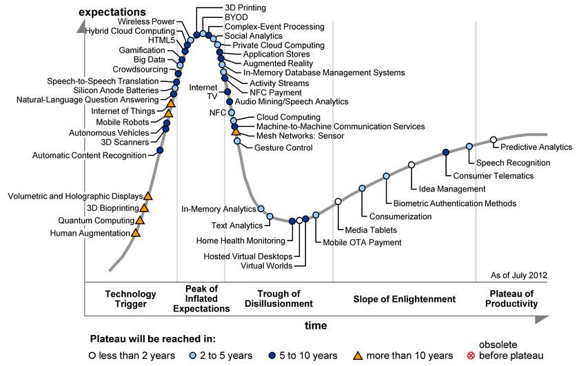

# The Gartner Hype Cycle

Embrace the idea that every technology will go through a peak of inflated expectations, and that hype may or may not pay off in the long run.

Use that knowledge to make wise choices about how you invest your time and efforts.

\- Eliza

