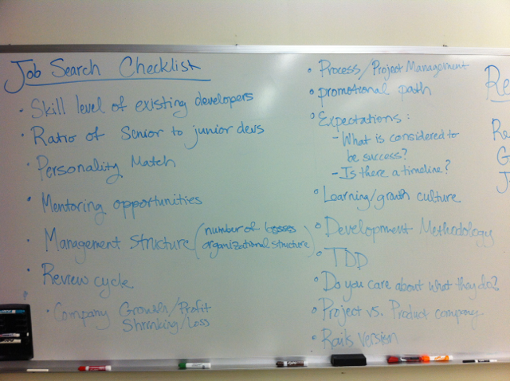

# Finding a Good Fit

## How to determine if a company is a good fit for you. How to determine if your'e a good fit for a company.

## Employer Business Models

B2B, B2C, agency, product, etc.

## Company Culture

e.g. military, casual, corporate, hierarchical, etc.

<!-- TODO -->

https://medium.com/p/4bbf84c55dbf

http://www.wired.com/2014/04/no-exit/

https://medium.com/@fox/where-to-work-4bbf84c55dbf

https://the-pastry-box-project.net/greg-hoy/2014-April-17
