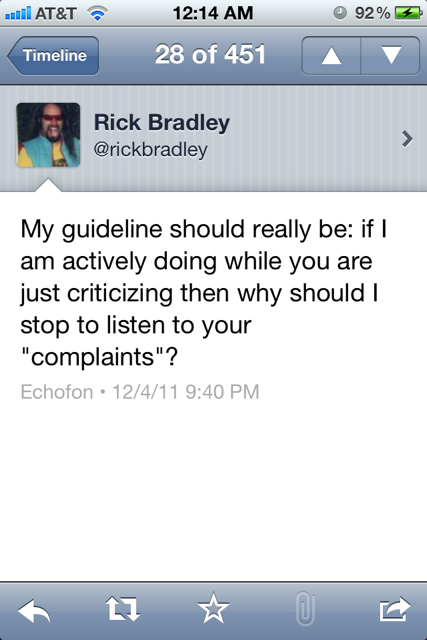
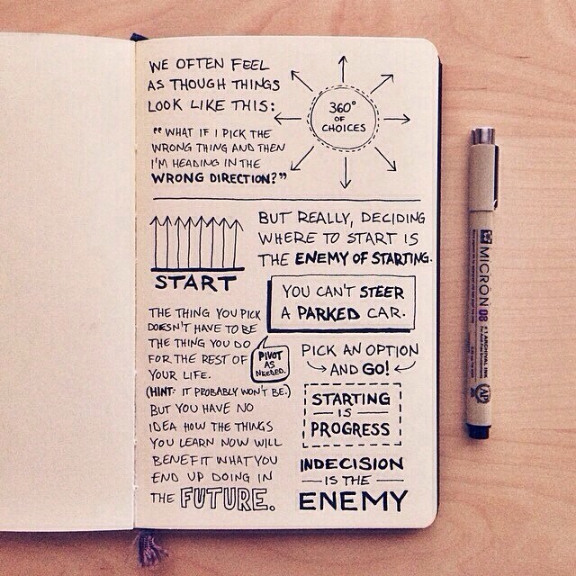
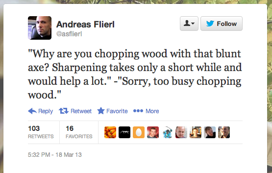
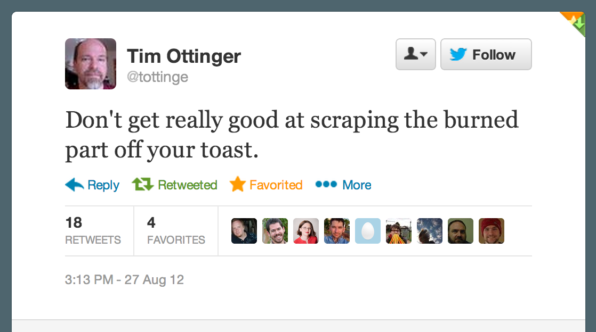
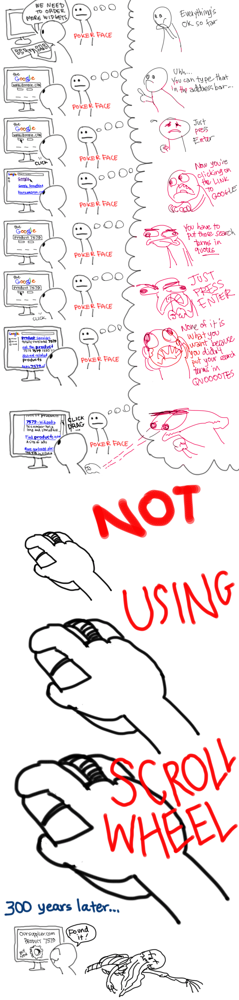

# Emergency Inspiration

https://medium.com/@sanjayginde/programming-is-failure-b4c8a249e70f

[Unstuck Best Of 2013](Unstuck_BestOf2013.pdf)

<blockquote class="twitter-tweet" lang="en">
I&#39;m all origin story and no superpowers.
&mdash; Alex Baze (@bazecraze) <a href="https://twitter.com/bazecraze/status/307593334531190784">March 1, 2013</a></blockquote>

<blockquote class="twitter-tweet" lang="en">
#1: Let&#39;s be honest. There&#39;s no way your guess is as good as mine.
&mdash; GS Elevator Gossip (@GSElevator) <a href="https://twitter.com/GSElevator/status/397965596744482816">November 6, 2013</a></blockquote>

<blockquote class="twitter-tweet" lang="en">
Getting moderately good at programming has taken about 20 years longer than I expected.
&mdash; John D. Cook (@JohnDCook) <a href="https://twitter.com/JohnDCook/status/423844816137756672">January 16, 2014</a></blockquote>

http://stilldrinking.org/programming-sucks
