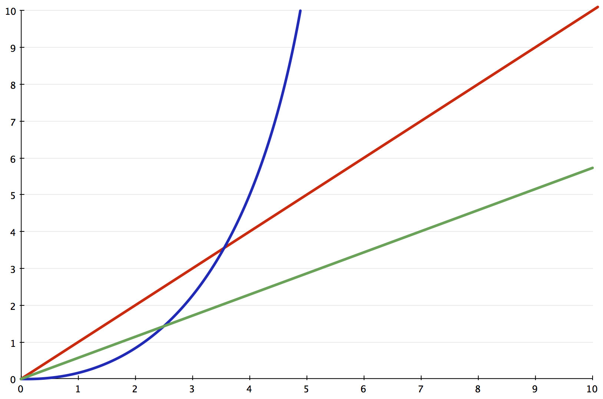

<!-- TODO: https://medium.com/@_marcos_otero/the-real-10-algorithms-that-dominate-our-world-e95fa9f16c04 -->

# Introduction to Algorithmic Complexity

>  In computer science, big O notation is used to classify algorithms by how they respond (e.g., in their processing time or working space requirements) to changes in input size. (Wikipedia)

What it boils down to is: “How expensive is this algorithm?”

## Big Oh

> Big O is the most commonly used asymptotic notation for comparing functions (Wikipedia)

Big-O is the most common way to convey how expensive (or cheap) an algorithm is.  Depending on the size of your program's input and the constraints of your processing power (CPU), storage (Disk space), or memory (RAM), different algorithms will perform better.

### A tool for selecting algorithms

We use Big-O as a tool for selecting the best algorithm for the task at hand.

For example, in the graph below, the algorithm in blue is superior for small inputs but becomes prohibitvely expensive for moderately sized inputs.  In contrast, the algorithm denoted in green is compartatively expensive for small inputs but becomes the best choice once the input size gets larger.

### Classes of Complexity

Various classes of algorithms (e.g. searching, sorting, cryptography), the best possible Big-O isn't necessarily a "good" Big-O due to the theoretical limits involved.  However, Big-O is a good way for us to convey those limits.

Big-Oh notation is a mathematical expression of the worst-case performance of an algorithm.  The size of the input is denoted by `n`. The formula provided is simplified such that a performance of `2n + 12` would be expressed as `O(2n)`.

    | Big Oh   | Name        | Interpretation |
    | O(1)     | Constant    | The Best       |
    | O(log n) | Logarithmic | Pretty good.   |
    | O(n)     | Linear      | Ok.            |
    | O(n^2)   | Quadratic   | Bad            |
    | O(2^n)   | Exponential | Terrible.      |
    | O(n!)    | Factorial   | Awful.         |

The following chart (adapted from Dave Perrett's article, cited below) demonstrates how the different sizes of inputs translate into different performance results:

    | Big Oh     | Name        | n = 10  | n = 100                                   |
    | O(1)       | Constant    | 1       | 1                                         |
    | O(log n)   | Logarithmic | 3       | 7                                         |
    | O(n)       | Linear      | 10      | 100                                       |
    | O(n log n) | Logarthmic  | 30      | 700                                       |
    | O(n^2)     | Quadratic   | 100     | 10,000                                    |
    | O(2^n)     | Exponential | 1024    | 1,267,650,600,228,229,401,496,703,205,376 |
    | O(n!)      | Factorial   | 3628800 | 100! (see below)                          |

100! = 93,326,215,443,944,152,681,699,238,856,266,700,490,715,968,264,381,621,468,592,963,895,217,599,993,229,915,608,941,463,976,156,518,286,253,697,920,827,223,758,251,185,210,916,864,000,000,000,000,000,000,000,000

(Source: Dave Perrett)

### Calculating Big-O

Really Basic Example:

There are n items in an array.  My algorithm loops 3n + 1024 times.

Big O simplifies out all constants, as such:

    3n + 1024
    simplifies down to:
    3n
    simplifies down to:
    O(n)

The references below contain more in-depth and nuanced explanations of calculating Big O.

### Alternatives

There are alternative notations, for example Big-Theta, little-O, etc., that are used to convey other information about an algorithm's performance.

## Sources:

* [Wikipedia: Big O Notation](http://en.wikipedia.org/wiki/Big_O_notation)
* [Big-O Cheat Sheet](http://bigocheatsheet.com/)
* [Dave Perrett's CompSci 101 - Big-O notation](http://www.daveperrett.com/articles/2010/12/07/comp-sci-101-big-o-notation/)
* [Quora: What is the big O notation and how do I calculate it?](http://www.quora.com/Big-O-Notation/What-is-the-big-O-notation-and-how-do-I-calculate-it)
* [Justing Abrahms: Big-O is easy to calculate, if you know how](http://justinlilly.com/computer-science/how-to-calculate-big-o.html)
* [Stack Overflow: Plain English explanation of Big O](http://stackoverflow.com/questions/487258/plain-english-explanation-of-big-o)
