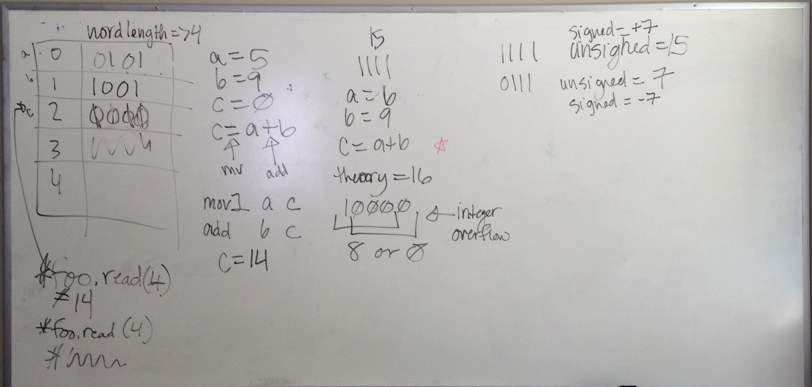

# Basics of Assembly

> An assembly language is a low-level programming language for a computer, or other programmable device, in which there is a very strong (generally one-to-one) correspondence between the language and the architecture's machine code instructions. Each assembly language is specific to a particular computer architecture, in contrast to most high-level programming languages, which are generally portable across multiple architectures, but require interpreting or compiling. (Wikipedia)

## How Assembly Relates to this Course

## In Class Examples:

(Take the accuracy of these with a grain of salt, since I [Eliza] haven't actually done assembly since 2007.)

### Cohort 3, Integer Overflows

### Cohort 4, Addition in Assembly

## Sources:

* [Wikipedia: Assembly Language](http://en.wikipedia.org/wiki/Assembly_language)
* [IA32 Assembly Cheat Sheet](IA32_Cheat_Sheet.pdf)

## TODO:

Better, more accurate, examples based on the drawings from class.
