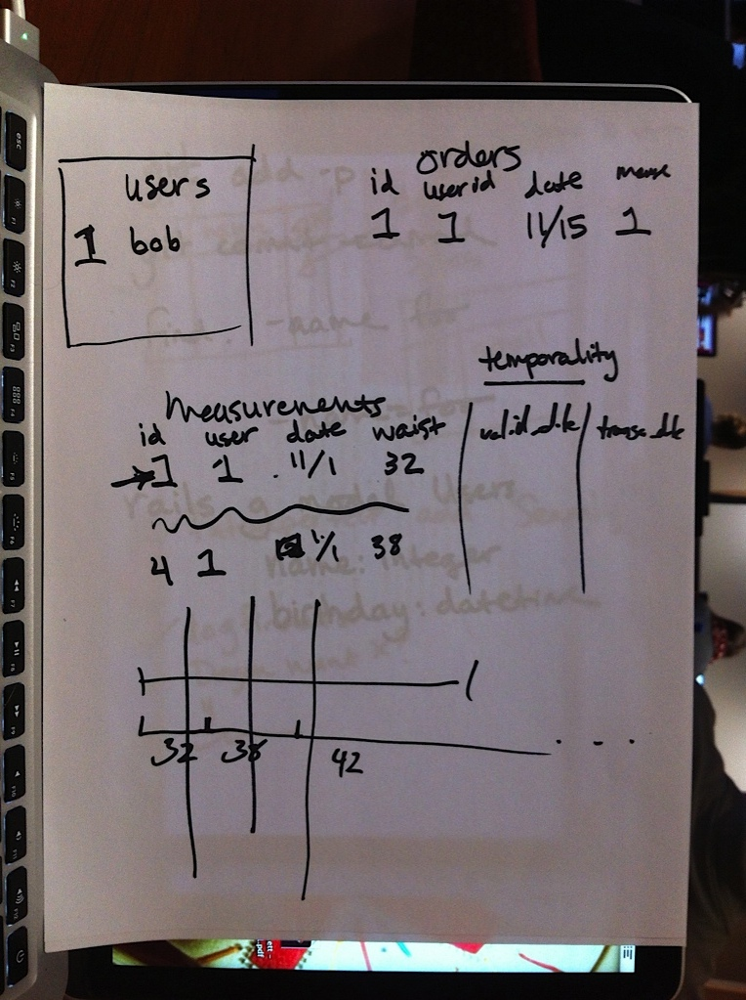
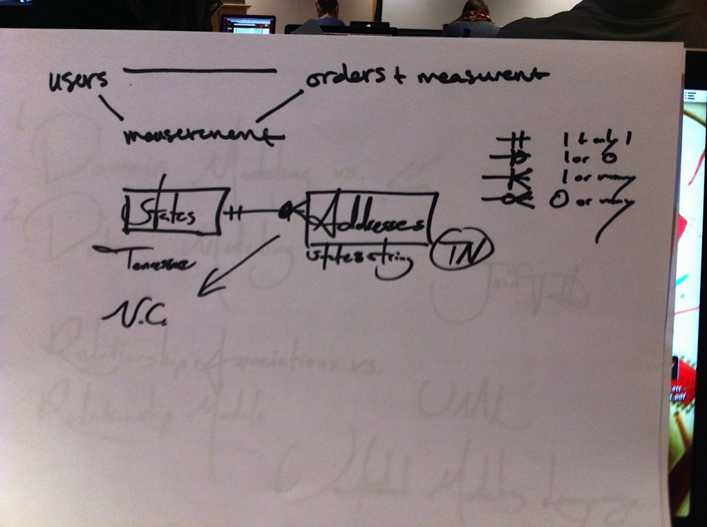
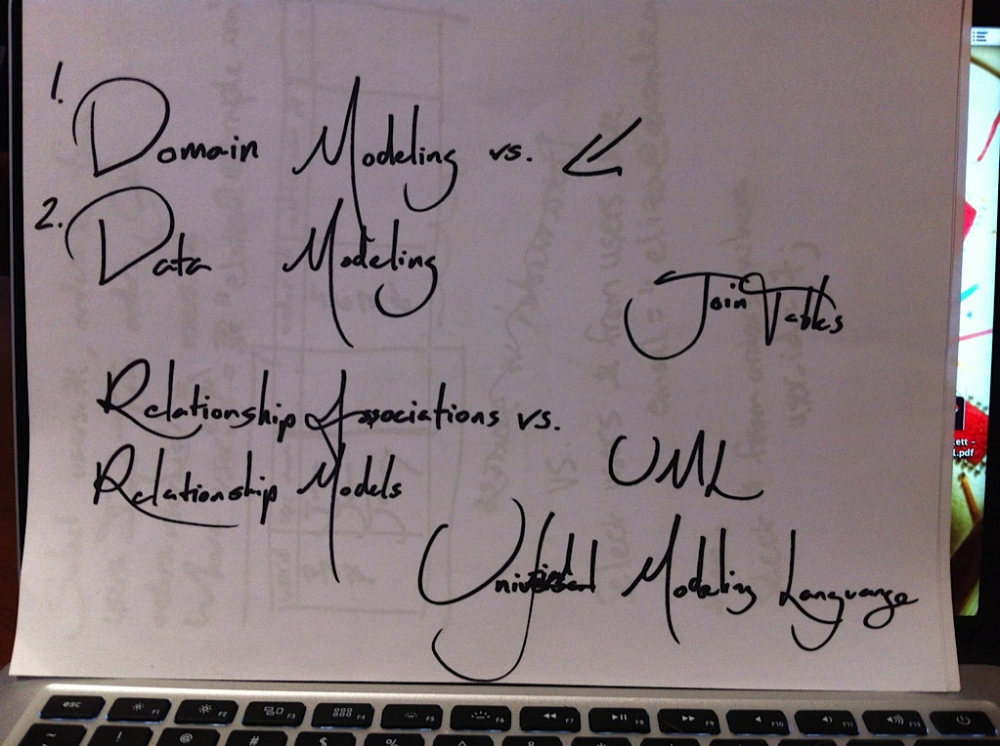
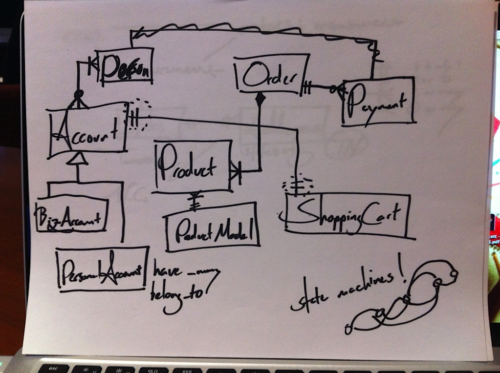
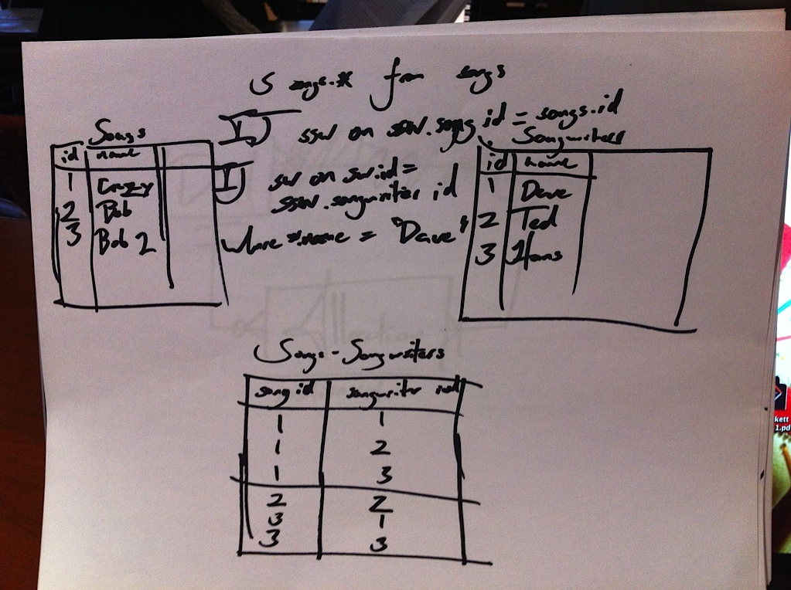
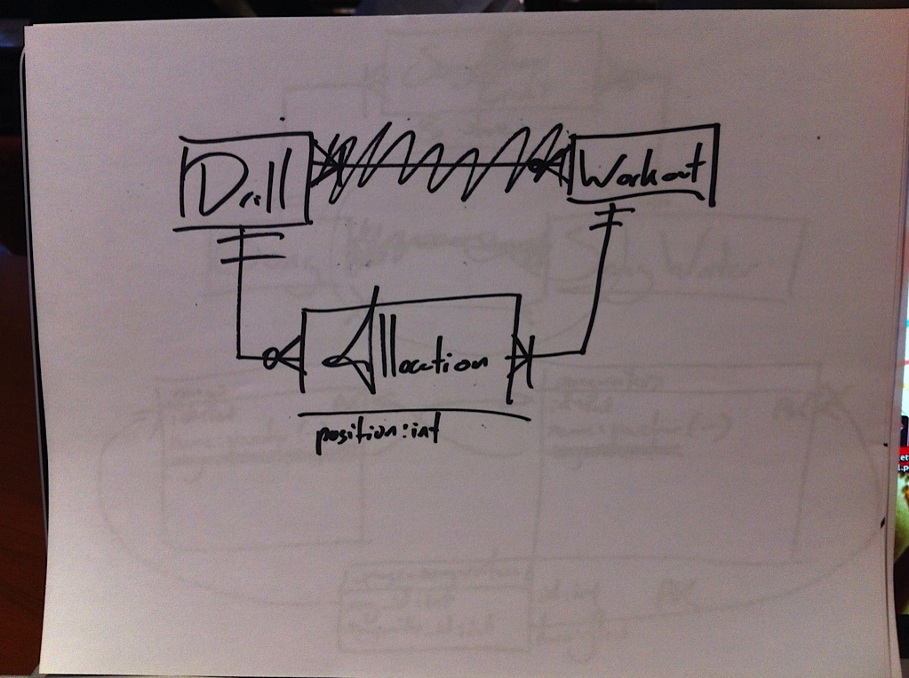

# Domain Driven Design

<!-- TODO -->

On Friday the 17th, Jeremy Holland came in to talk with us about join tables and domain design.

Rachel noted the following books, that Jeremy recommended:

    > Jeremy Holland suggested a couple books on Domain Driven Design.
    >
    > Here are the books and a few useful links.
    >
    > Domain Driven Design
    > http://books.google.com/books?id=hHBf4YxMnWMC&printsec=frontcover#v=onepage&q&f=false
    >
    > Domain Driven Design Quickly
    > http://www.infoq.com/minibooks/domain-driven-design-quickly
    >
    > Blog Post with Resources
    > http://weblogs.asp.net/arturtrosin/archive/2009/02/09/domain-driven-design-learning.aspx
    >
    > This video is not very good visually, but the audio is good. So far I've been 10 minutes into the video and he is very easy to understand. Very clear walkthrough on Domain Modeling. He wrote the book above, Domain Driven Design.
    > http://www.infoq.com/presentations/model-to-work-evans

Katie was kind enough to photograph the notes we took during class, and those are available as items 25 through 35 in the unit2 folder.

Those Images:

* 
* 
* 
* 
* 
* 
* 
* 
* 
