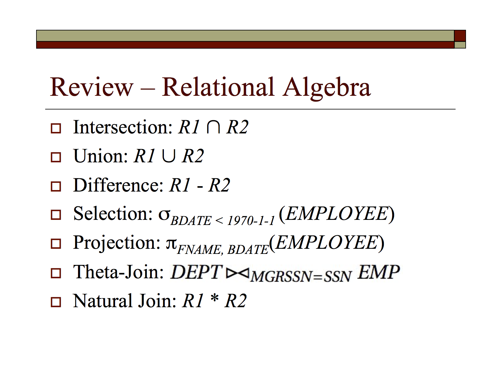

# Relational Algebra

Cheat Sheet (courtesy of Curt Clifton's CSSE 333 slides):

Relational Algebra, while very relevant to understanding databases is outside the scope of this class.

However, if you're interested in learning more about relational algebra, [Curt Clifton's Relational Model and Relational Algebra](RelationalModelAndAlgebra.pdf) slides are a very useful start.
