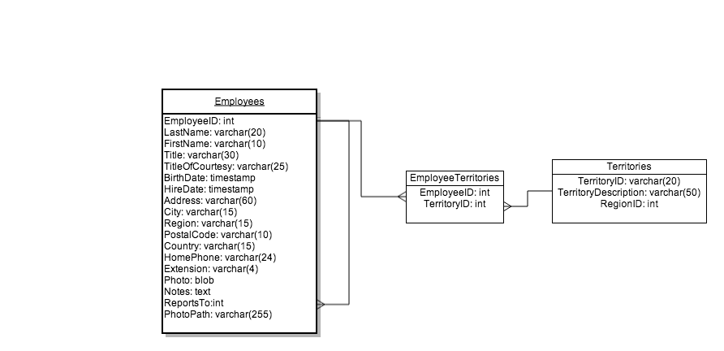

# Northwind ERD Diagram

You can import the Northwind database using [SQLite Database Browser](https://github.com/sqlitebrowser/sqlitebrowser) or the [SQLite Manager Firefox Plugin](https://addons.mozilla.org/en-US/firefox/addon/sqlite-manager/)

## Create an ERD of the Northwind database.

Use a diagramming tool (for example, [Lucid Chart](https://www.lucidchart.com/pages/er-diagram-tool)) to create a database diagram for the [Northwind](https://github.com/elizabrock/software-development-curriculum/blob/master/exercises/07-databases-practice-incl-northwind/northwind_rails_style.sql) database.

An example beginning of this is:

Use the crow's foot notation, as shown here: [http://www.vivekmchawla.com/2013/04/erd-crows-foot-relationship-symbols-quick-reference.html](http://www.vivekmchawla.com/2013/04/erd-crows-foot-relationship-symbols-quick-reference.html)

## Read about SQL

* Read: https://coursewareofthefuture.herokuapp.com/courses/3/materials/computer-science/databases/introduction-to-databases.md
* Read: http://tutorials.jumpstartlab.com/topics/fundamental_sql.html
* Take a look at: http://sql.learncodethehardway.org/book/
