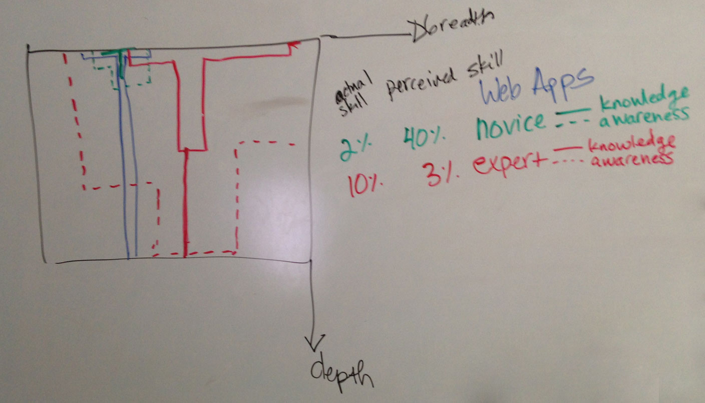

# T-Shaped People

> The concept of T-shaped skills, or T-shaped persons is a metaphor used in job recruitment to describe the abilities of persons in the workforce. The vertical bar on the T represents the depth of related skills and expertise in a single field, whereas the horizontal bar is the ability to collaborate across disciplines with experts in other areas and to apply knowledge in areas of expertise other than one's own. -- Wikipedia

The example we drew in class for Cohort Blueberry:

## References & Further Reading:

* [Wikipedia: T-shaped skills](http://en.wikipedia.org/wiki/T-shaped_skills)
