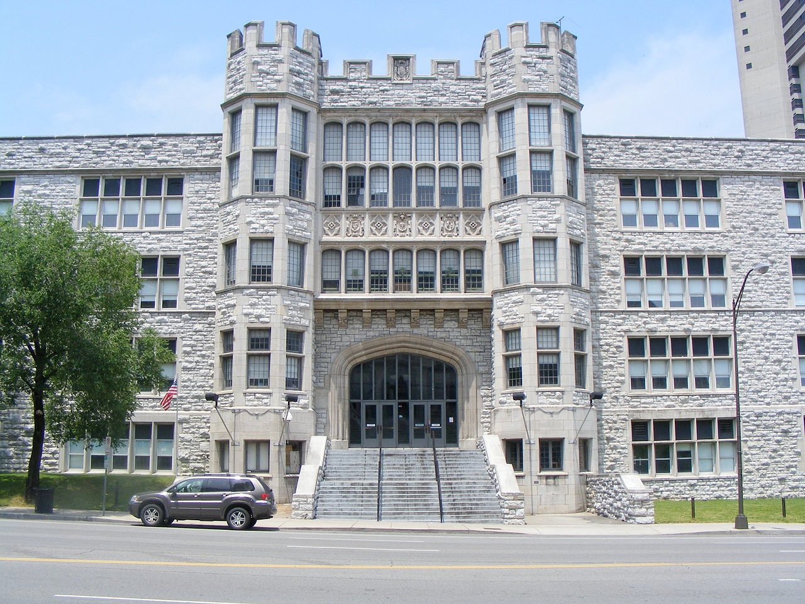
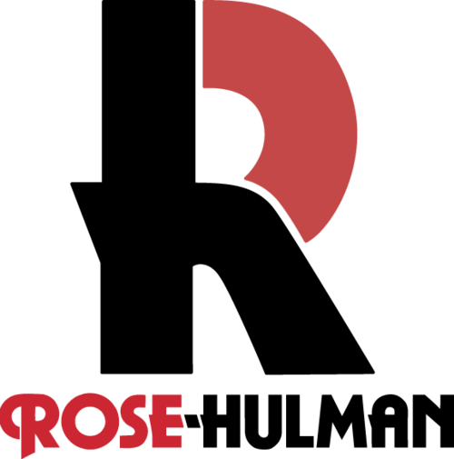

# Eliza's Background

## Who Am I?

I'm Eliza Brock, Software Engineer.

I went to highschool in Nashville, at Hume-Fogg.

And then, attended Rose-Hulman, a small yet well-regarded engineering school in Terre-Haute, IN.

I graduated with a double major in Software Engineering and Computer Science.

After 5 delightless winters in Indiana, I was terribly homesick for Nashville.  I spent a lot of time fantasizing about returning to Centennial Park.

I then started Eliza Brock Software and, a few years later, started teaching at Nashville Software School.

